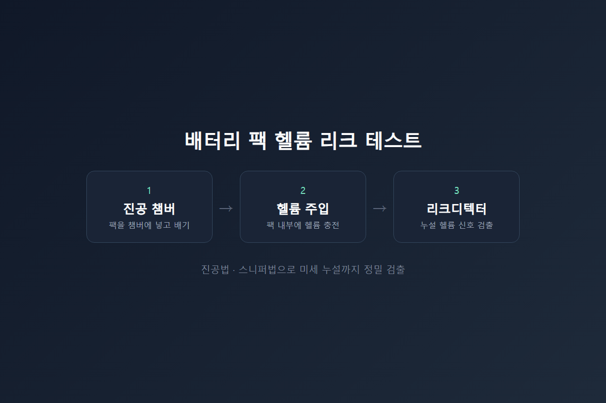
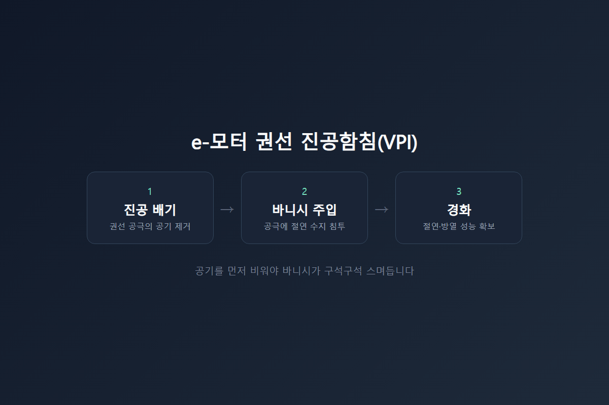
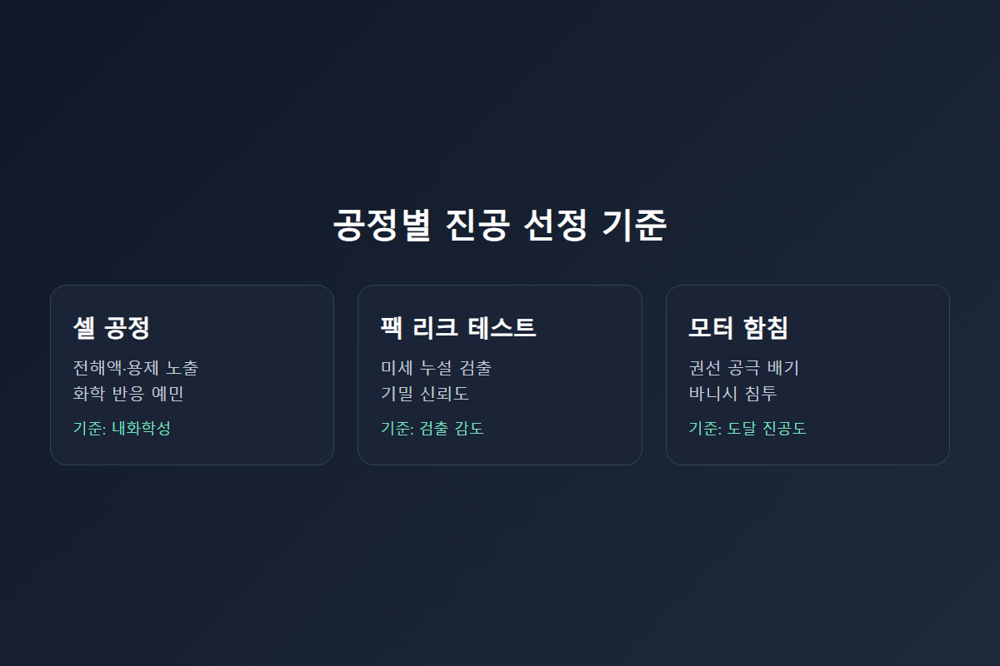
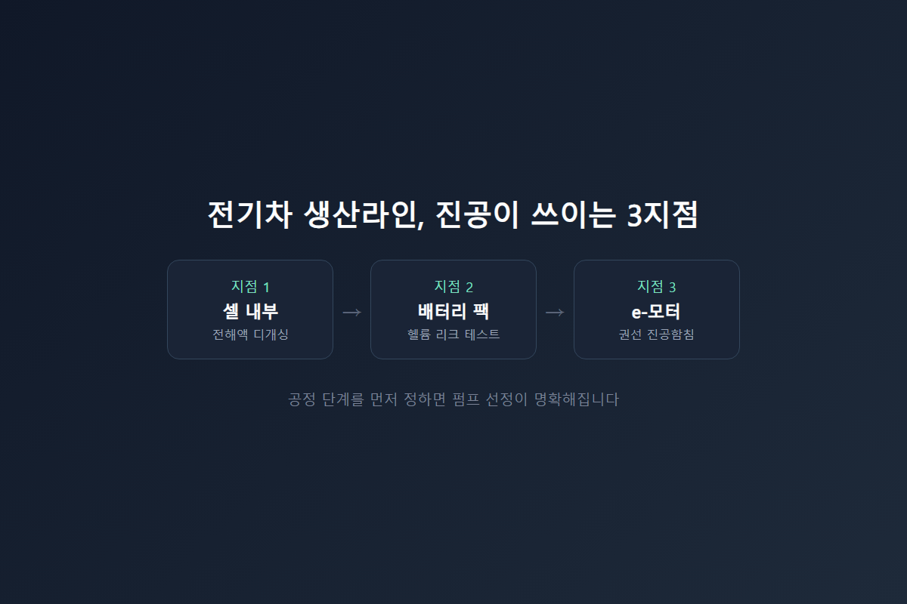

<!-- 수치검증: A항목 0개(신규 수치 없음) / B항목 0개 / C항목 0개 / D항목 0개 / 삭제 0개 / 교체 0개 -->
---
category: 기술문의
---

# 전기차 배터리 팩·모터 라인, 셀 말고 어디에 진공이 필요할까

전기차 배터리 관련 진공 문의는 대부분 셀 내부 공정으로 시작합니다. 어느 공정을 먼저 검토해야 할지부터 헷갈려 하는 경우가 많습니다. 슬러리 건조, 전해액 주입, 디개싱까지 셀 단위 공정은 이미 잘 알려져 있습니다. 하지만 완성차 생산라인 전체로 시야를 넓히면, 셀을 완성한 다음에도 진공이 필요한 공정이 두 군데 더 있습니다. 배터리 팩 조립 라인과 전동 모터(e-모터) 생산 라인입니다. 두 공정 모두 완성차의 안전·성능과 직결됩니다.

## 배터리 팩은 왜 진공 챔버에 들어갈까

셀을 모아 모듈을 만들고, 모듈을 다시 모아 팩을 완성하면 마지막 단계에서 기밀 시험을 거칩니다. 배터리 팩 하우징과 냉각수 라인이 조금이라도 새면 주행 중 침수나 냉각수 누액으로 이어질 수 있기 때문입니다.

이 시험에 쓰이는 방법이 헬륨 리크 테스트입니다. 진공법과 스니퍼법 두 가지 방식으로 미세 누설까지 정밀하게 검출합니다. 팩 내부를 진공으로 만들고 헬륨을 채운 뒤, 헬륨 리크디텍터로 새어 나오는 헬륨 신호를 잡아내는 방식이 산업 전반에서 표준적으로 쓰입니다. 육안 검사나 수압 시험으로는 잡히지 않는 수준의 미세 누설까지 검출할 수 있다는 것이 이 방식의 핵심입니다.

## e-모터 권선에도 진공이 들어간다

전기차를 움직이는 구동 모터, 이른바 e-모터의 심장부는 고정자(스테이터) 권선입니다. 이 권선의 절연성과 방열 성능을 높이기 위해 바니시(수지)를 함침하는 공정이 있습니다.

권선 다발 안에는 미세한 공극이 많습니다. 이 공극에 공기가 남아 있으면 바니시가 완전히 스며들지 못하고, 절연 성능과 열전달 성능이 떨어집니다. 그래서 먼저 진공으로 권선 내부의 공기를 뽑아낸 다음, 바니시를 주입해 공극을 채우는 방식을 씁니다. 진공으로 공기를 미리 비워두어야 바니시가 구석구석 스며들 수 있기 때문입니다.

공극에 공기가 남아 있는 상태로 함침을 마치면, 그 부분이 절연 취약점이 되어 고전압·고회전 환경에서 국부 발열이나 절연 파괴로 이어질 위험이 있습니다. 전기차 구동 모터처럼 상시 높은 부하를 받는 부품일수록 이 공극 제거 단계의 완성도가 곧 모터 수명과 직결됩니다.

## 셀 공정과 무엇이 다른가

셀 단위 공정(전해액 디개싱 등)은 화학적으로 예민한 환경입니다. 반면 팩 리크 테스트와 모터 함침은 화학 반응보다 물리적인 기밀·함침 성능이 핵심입니다. 그래서 펌프를 고를 때 보는 기준도 달라집니다.

- **셀 공정**: 전해액·용제에 대한 내화학성이 우선 기준
- **팩 리크 테스트**: 미세 누설까지 잡아내는 검출 감도가 우선 기준
- **모터 함침**: 공극까지 공기를 비우는 도달 진공도와 배기 속도가 우선 기준

같은 전기차 생산라인이라도 공정 단계마다 요구 조건이 서로 다릅니다. 그래서 어느 단계의 진공인지부터 먼저 정리하는 것이 펌프 선정의 출발점이 됩니다. 셀 공정은 화학적 내성, 팩 리크 테스트는 검출 감도, 모터 함침은 도달 진공도라는 서로 다른 축을 기준으로 접근해야 합니다.

## 전동화가 늘어날수록 진공 공정도 늘어난다

내연기관 차량에는 배터리 팩 리크 테스트나 모터 진공함침 같은 공정이 필요하지 않았습니다. 엔진과 변속기가 구동을 담당했고, 배터리는 시동·전장용 소형 부품에 그쳤기 때문입니다.

전기차는 다릅니다. 배터리 팩이 차량 하부 전체를 차지하는 대형 부품이 되면서 기밀 신뢰도 요구 수준이 완전히 달라졌습니다. 구동 모터도 내연기관보다 훨씬 높은 회전수와 발열을 견뎌야 해서, 권선 절연·방열 성능을 확보하는 함침 공정의 중요도가 높아졌습니다. 완성차·부품사가 전동화 라인을 늘릴수록, 이 두 공정에 들어가는 진공 설비 수요도 함께 늘어나는 구조입니다. 배터리·모터를 자체 생산하는 완성차 업체는 물론, 이를 위탁 생산하는 부품사에도 그대로 해당하는 흐름입니다.

이 흐름은 배터리 팩 하나에서 끝나지 않습니다. 같은 차량 안에서도 셀·팩·모터 세 지점이 각각 다른 이유로 진공을 필요로 하고, 세 지점 모두 품질 불량이 곧바로 안전 문제로 이어질 수 있는 부품입니다. 그만큼 공정 초기 단계에서부터 어떤 펌프·검사 장비 조합이 필요한지 명확히 해두는 것이 이후 라인 증설 시에도 시행착오를 줄이는 방법입니다.

## 세 지점을 한 번에 정리하면

전기차 한 대가 완성되기까지 진공은 최소 세 지점에서 쓰입니다. 셀 내부의 전해액 디개싱, 배터리 팩의 헬륨 리크 테스트, 그리고 모터 권선의 진공함침입니다.

지금 검토 중인 공정이 이 셋 중 어디에 해당하는지 먼저 확인하는 것이 순서입니다. 화학적으로 예민한 환경인지, 아니면 물리적인 밀봉·함침 정밀도가 더 중요한 환경인지에 따라 적합한 펌프 방식과 리크디텍터 조합이 달라집니다. 셀 공정 경험만으로 팩·모터 공정 펌프까지 그대로 적용하면 검출 감도나 도달 진공도가 맞지 않을 수 있습니다.

특히 라인을 새로 증설하는 단계에서 이 실수가 자주 나옵니다. 셀 공정에서 쓰던 펌프 사양을 검증 없이 팩·모터 공정에 그대로 옮기면, 검출 감도가 부족한 리크디텍터가 미세 누설을 놓치거나, 도달 진공도가 부족한 펌프로 함침한 권선 공극에 공기가 남는 문제가 뒤늦게 발견되곤 합니다.

---

배터리 팩 헬륨 리크 테스트, e-모터 진공함침 공정 구성 상담 가능. 공정 단계(셀/팩/모터)를 먼저 확인한 뒤 적합한 펌프·리크디텍터 조합을 검토합니다. 라인 증설이나 신규 라인 도입 단계라면 공정별 요구 조건을 처음부터 구분해 설계하는 것이 재작업을 줄이는 방법입니다.
