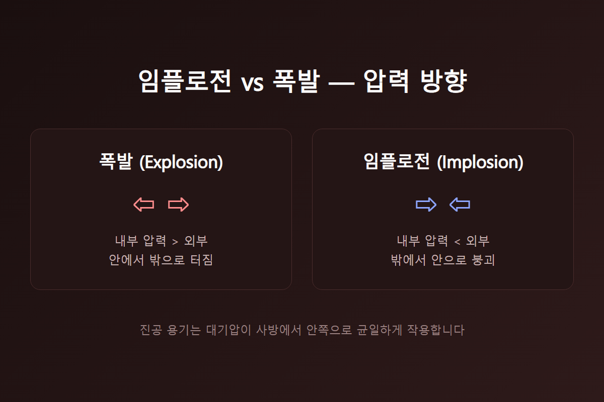
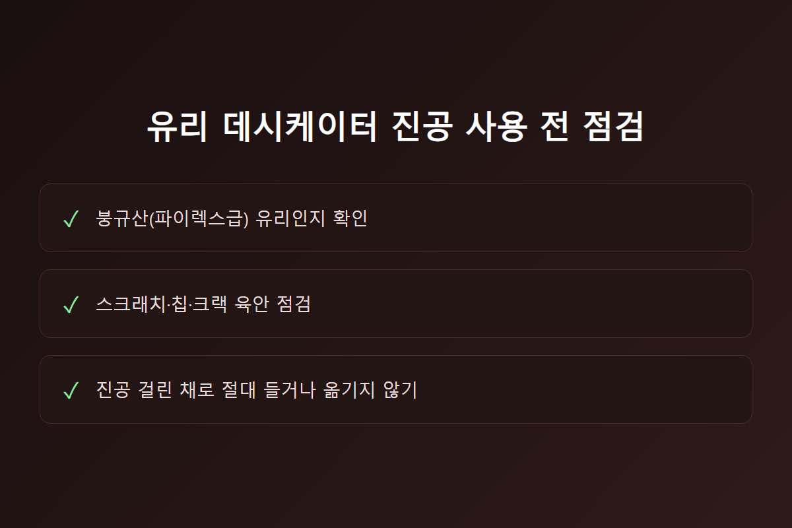
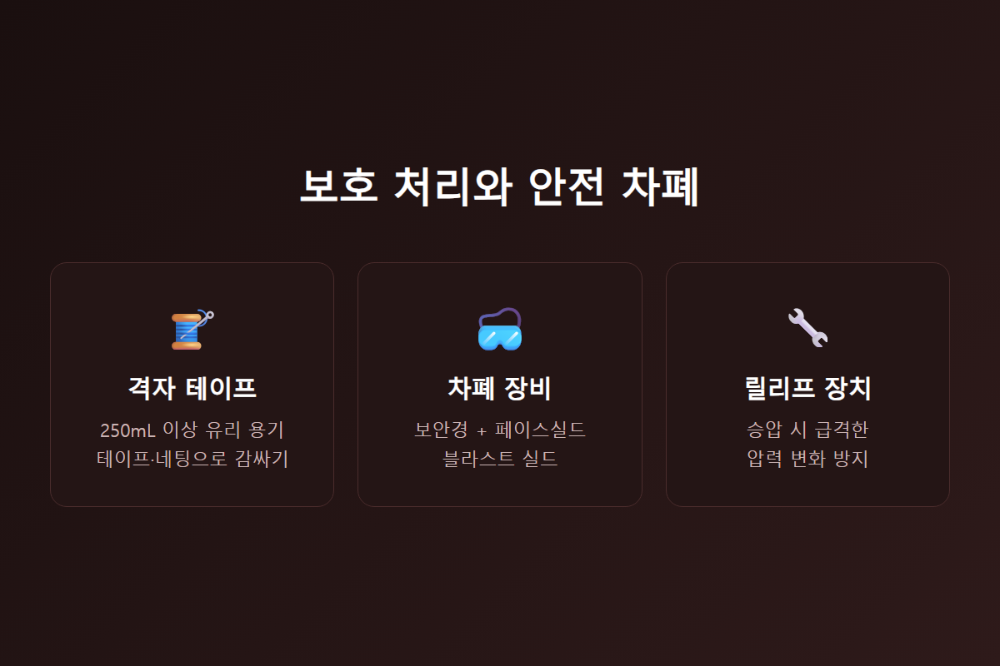
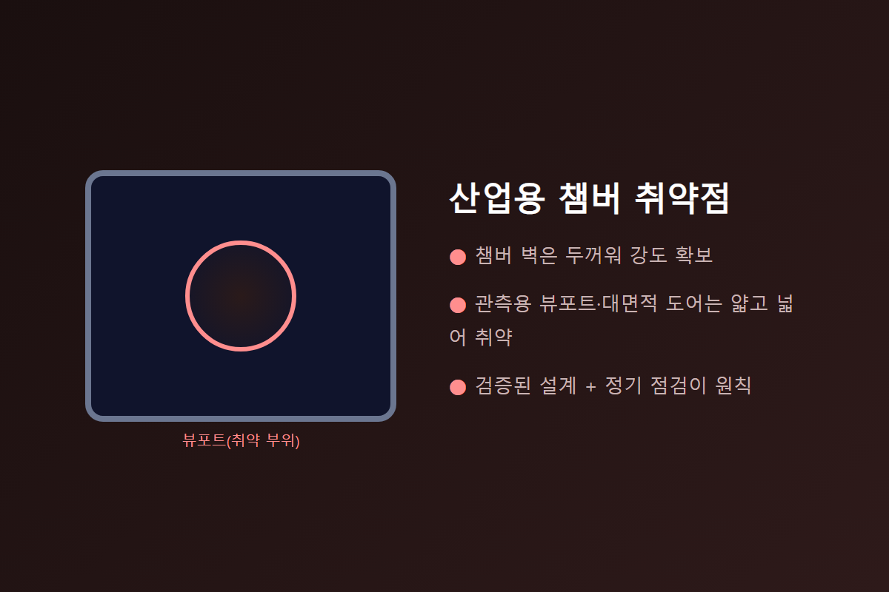

<!-- 수치검증: A항목 0개(펌프 스펙 수치 없음, 안전 실무 절차만 다룸) / B항목 0개 / C항목 0개 / D항목 0개 / 삭제 0개 / 교체 0개 -->

# 진공 챔버 임플로전(내파) 사고 원인과 안전 점검 기준

임플로전(implosion, 내파)은 용기 내부가 대기압보다 낮아진 상태에서, 바깥 압력을 못 견디고 안쪽으로 순간 붕괴하는 사고다. 폭발과 정반대 방향의 파괴 메커니즘이다.

진공 라인을 다루는 현장에서 이 사고가 특히 위험한 이유는 사전 경고 신호 없이 갑자기 일어난다는 점이다. 서서히 금이 가다가 어느 순간 견디는 것이 아니라, 응력이 집중된 지점에서 임계점을 넘는 순간 전체가 동시에 붕괴한다. 유리 파편이 사방으로 튀는 데 걸리는 시간은 1초가 채 안 될 정도로 짧다. 그래서 사고가 난 뒤 대응보다, 애초에 사고가 나지 않도록 만드는 예방 조치가 압도적으로 중요하다.

## 왜 일어나는가

진공 용기는 벽 전체에 대기압을 균일하게 받는다. 유리·아크릴처럼 압축에는 강해도 인장에는 약한 소재는, 스크래치나 두께 불균일이 있는 지점에 응력이 집중된다. 그 지점에서 붕괴가 시작돼 순식간에 전체가 무너진다.

같은 재질, 같은 두께라도 흠집 하나 없는 용기와 미세한 스크래치가 있는 용기의 실제 내압 성능은 크게 다르다. 스크래치는 눈에 잘 안 띄지만 그 지점의 실제 강도를 국소적으로 크게 낮춘다. 겉보기엔 멀쩡해 보여도 이전에 몇 번 진공을 걸었던 이력이 있는 용기라면, 매번 사용 전 재점검이 필요한 이유가 여기에 있다.

## 유리 용기 안전 기준

- **소재**: 진공용 유리는 반드시 붕규산 유리(파이렉스급)를 쓴다. 일반 유리는 내압 설계가 아니다. 실험 기자재를 구매할 때 "진공용"이라고 명시된 제품인지, 단순히 투명 용기인지 구분하는 것이 첫 단계다.
- **점검**: 사용 전마다 스크래치·칩·크랙 여부를 육안 확인한다. 흠집 있는 유리는 진공에 쓰지 않는다.
- **취급**: 데시케이터는 진공이 걸린 상태로 절대 들거나 옮기지 않는다.
- **보호 처리**: 250mL 이상 유리 용기(플라스크·리시버·범프 트랩 포함)는 격자 패턴 테이프나 네팅, 플라스틱 코팅으로 감싸 파편 비산을 최소화한다.
- **차폐**: 보안경 외에 페이스실드, 후드 새시, 이동식 블라스트 실드 등으로 비산 경로를 차단한다.

위 다섯 가지는 별개의 조치가 아니라 서로를 보완하는 관계다. 소재 기준을 지켜도 점검을 건너뛰면 흠집을 놓친다. 점검을 철저히 해도 보호 처리를 생략하면, 예상 못 한 원인으로 붕괴가 일어났을 때 파편을 막을 방법이 없다. 다섯 가지 조치를 하나의 세트로 묶어 운영해야 실질적인 안전을 확보할 수 있다.

## 압력 복귀와 정기 검사

가스로 승압시켜 대기압으로 되돌릴 때는 가스 공급원과 용기 사이에 릴리프 장치를 설치한다. 급격한 압력 변화 자체가 별도의 사고 원인이 되기 때문이다. 반복 사용하는 용기는 주기적으로 내압 검사를 받고, 큰 수리·개조나 과압·과온 이력이 있으면 재검사한다. 감압·승압 속도도 급격히 조절하지 않고 서서히 진행한다.

감압 속도를 급하게 잡는 실수는 특히 자동화 라인에서 자주 나온다. 사이클 타임을 줄이려고 진공 밸브를 빠르게 열면, 용기가 짧은 시간에 큰 압력차를 견뎌야 한다. 서서히 감압하도록 밸브 개도나 시퀀스를 설계해 두면, 같은 용기라도 실제 수명과 안전 여유가 크게 늘어난다. 정기 내압 검사 주기는 용기 재질·사용 빈도·설치 환경에 따라 달라지므로, 제작사가 제시하는 권장 주기를 기본값으로 삼고 사용 이력에 따라 앞당기는 방식이 안전하다.

## 산업용 금속 챔버의 취약점

금속 챔버는 벽 두께로 강도를 확보하지만, 관측용 뷰포트나 대면적 평판 도어처럼 얇고 넓은 부위는 원리상 동일한 취약점을 갖는다. 검증된 설계의 챔버·뷰포트를 사용하고 정기 점검하는 원칙은 유리 용기와 같다. 대형 챔버의 구체적 설계 강도 기준은 제작사·용도별로 다르므로, 설비 도입 시 뷰포트 재질·두께와 점검 주기를 확인해야 한다.

뷰포트는 챔버를 설계할 때부터 두께와 재질이 압력 조건에 맞춰 계산돼 나온다. 문제는 설치 후 시간이 지나면서 생기는 변수다. 세정제가 유리 표면에 미세한 화학적 손상을 남기거나, 청소 중 공구가 스치면서 흠집이 생기는 경우가 실제로 있다. 신규 설비를 계약할 때 뷰포트 사양을 확인하는 것만큼, 가동 중인 설비의 뷰포트를 정기적으로 육안 점검하는 절차를 운영에 포함시키는 것이 중요하다.

설비를 오래 운영하는 현장일수록 이 점검이 형식적으로 흐르기 쉽다. 초기 몇 년은 매뉴얼대로 점검하다가, 특별한 이상이 없었다는 이유로 점검 주기가 슬그머니 늘어나는 경우가 많다. 하지만 유리·아크릴 뷰포트의 미세 손상은 몇 년에 걸쳐 누적되는 경우도 있어서, "지금까지 괜찮았다"는 것이 앞으로도 괜찮다는 보장이 되지 않는다. 점검 이력을 기록으로 남겨두면, 다음 점검 시점에 이전 상태와 비교해 미세한 변화도 놓치지 않을 수 있다.

## 사고 발생 시 대응

임플로전 발생 시 즉시 해당 구역을 비우고, 위험 물질이 있으면 격리하며, 부상·파손 여부를 바로 보고한다. 사고가 지나간 이후에는 정확히 어느 지점에서 붕괴가 처음 시작됐는지 파악하는 과정도 매우 중요하다. 같은 라인에 동일 사양의 용기·챔버가 더 있다면, 원인이 규명되기 전까지 해당 장비의 사용을 중단하고 점검하는 것이 재발을 막는 가장 확실한 방법이다. 원인 규명 없이 서둘러 재가동하면 같은 사고가 반복될 위험이 그대로 남는다.

---

진공 용기·챔버의 뷰포트 사양 점검, 정기 안전 점검 주기 상담 가능. 안전 기준은 새 설비를 도입할 때만이 아니라, 기존 라인의 운영 절차를 다시 점검할 때도 함께 확인하시길 권한다.
