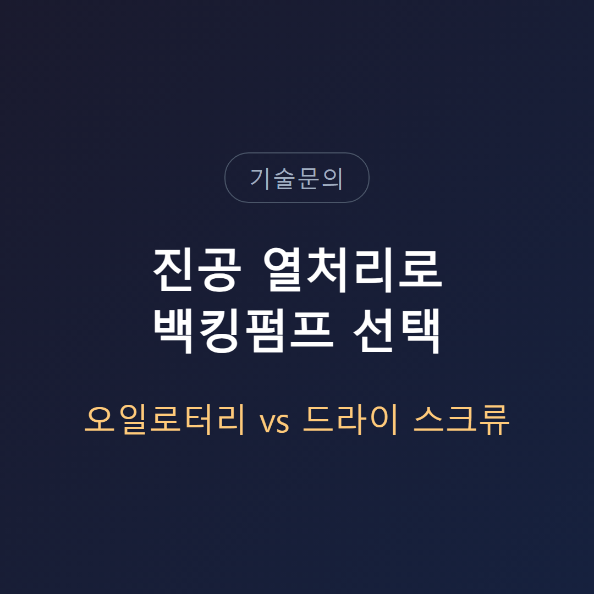
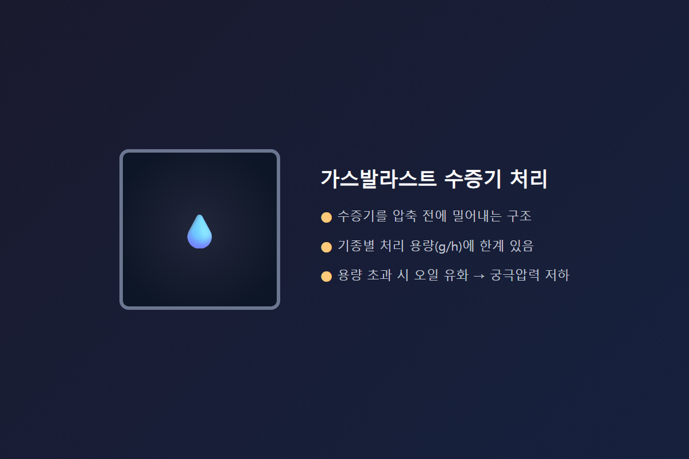
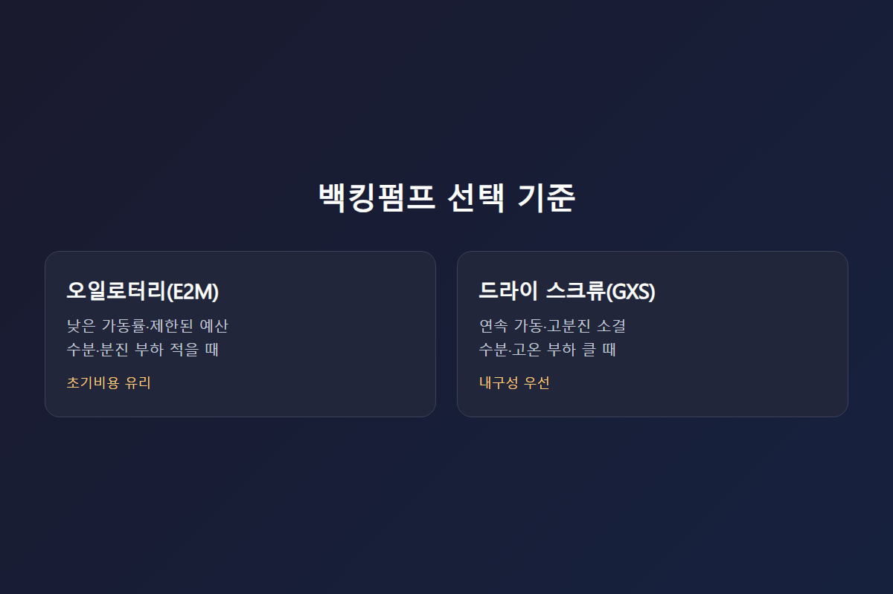
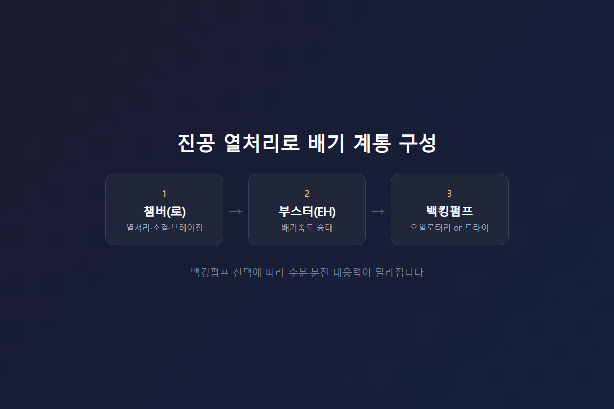

<!-- 수치검증: A항목 3개 확인(E2M 배기량·궁극압력, RV 수증기 처리용량, GXS 파우더 슬러그 테스트) / B항목 1개 확인(EH1200/2600/4200-E2M175/275 공식 백킹조합) / C항목 1개 확인(GXS=스크류, E2M=로터리베인) / D항목 0개 / 삭제 0개 / 교체 0개 -->
---
category: 기술문의
---

# 진공 열처리로 백킹펌프로 오일로터리펌프를 써도 되는가

진공 열처리로·소결로의 백킹펌프를 오일로터리로 유지할지, 드라이 스크류로 전환할지는 소형 설비나 구형 로 교체 시 반복적으로 나오는 질문입니다. 베이킹·브레이징·소결·진공유도용해·진공아크정련 같은 금속 열처리 공정은 원래 드라이 스크류 펌프가 대표 적용 분야로 꼽힙니다. 압축 과정에서 발생하는 열을 이용해 가스 부하가 큰 공정을 처리할 수 있다는 것이 드라이 스크류의 강점이기 때문입니다. 그렇다고 오일로터리펌프를 아예 배제할 필요는 없습니다. 조건이 맞으면 지금도 충분히 검토 대상이 됩니다.

## 오일로터리를 쓸 때 확인해야 할 두 가지 변수

첫 번째 변수는 수분입니다. 열처리로는 탈지·아웃가싱 과정에서 수증기가 배기 라인에 섞여 들어올 수 있습니다. 오일 펌프는 가스발라스트로 이 수증기를 압축 전에 밀어내지만, 기종별로 처리 용량에 한계가 있습니다. 이 용량을 넘는 부하가 지속되면 오일이 유화되면서 궁극 압력이 서서히 나빠집니다.

두 번째 변수는 고온과 분진입니다. 드라이 스크류는 압축열을 이용해 고온·고가스부하 조건을 견디도록 설계됐습니다. 오일로터리펌프는 오일 자체가 냉각·윤활을 겸하는 구조라서, 고온이나 분진이 섞인 배기 조건에서는 오일 열화나 베인 마모가 드라이 방식보다 더 빨리 진행될 수 있습니다. 소결 공정처럼 분말을 다루는 라인이라면 이 부분을 특히 신경 써야 합니다. 무급유 방식인 드라이펌프는 이런 마모 경로 자체가 없어서, 열처리로에 드라이펌프가 우선 권장되는 근본적인 이유가 됩니다.

## 그럼에도 오일로터리를 선택하는 경우

가장 큰 이유는 비용입니다. 소형 열처리로나 저가동률 설비, 예산이 제한된 신규 라인이라면 오일로터리펌프의 초기 투자비가 여전히 매력적입니다. 실제로 진공로 제작업체가 노후 피스톤형 오일펌프의 대체품을 문의한 사례에서도, 고순도 CVD가 아닌 일반 열처리로 용도로 기존 오일 밀봉 방식을 그대로 유지하려는 요구가 있었습니다. 가동률이 낮고 수분·분진 부하가 크지 않다는 전제가 있다면, 오일로터리펌프도 합리적인 선택지입니다.

## E2M 계열이 자주 검토되는 이유

백킹펌프로 오일로터리를 선택한다면 E2M 시리즈가 자주 검토됩니다. 2단 로터리베인 구조로 최대 배기량은 모델별로 42.5~292 m³/h까지 있고, 궁극 압력은 가스발라스트 없이 3.0×10⁻³ mbar 수준입니다. 표준 사양은 Ultragrade 70 오일을 쓰고, 산소농도가 21%를 넘는 환경에서는 PFPE 오일 사양(FX)이 별도로 필요합니다. 부스터(EH 시리즈)와 조합할 계획이라면 공식 매뉴얼 기준으로 EH1200·EH2600·EH4200 모두 E2M175 또는 E2M275를 권장 백킹펌프로 명시하고 있어, 이 기준을 따르는 것이 안전합니다.

## 오일로터리를 선택했다면 관리 계획도 함께 세워야 한다

오일로터리펌프로 백킹을 구성하기로 했다면, 펌프 선정만으로 끝나지 않습니다. 열처리로는 배치(batch)마다 아웃가싱 부하가 달라지는 경우가 많아서, 초기 스펙만 보고 설치한 뒤 방치하면 오일 상태가 예상보다 빨리 나빠지는 것을 뒤늦게 발견하게 됩니다. 가스발라스트 모드를 상시 켜둘지, 배치 종료 후에만 가동할지도 공정 특성에 따라 다르게 정해야 합니다.

오일 점검 주기는 제조사 권장 기준을 출발점으로 삼되, 실제 배기가스에 수분·유증기가 얼마나 섞이는지 현장에서 확인한 뒤 조정하는 것이 안전합니다. 오일이 우유빛으로 탁해지거나 궁극 압력이 평소보다 나빠졌다면, 정해진 교환 주기 이전이라도 점검이 필요한 신호로 봐야 합니다. 소결 라인처럼 분진이 섞이는 공정이라면 인렛 필터 설치 여부도 함께 검토하는 것이 좋습니다 — 드라이 스크류만큼의 분진 처리 능력은 없지만, 필터로 1차 방어선을 만들면 베인 마모 속도를 늦출 수 있습니다.

## 선택 기준 요약

- **가동률이 낮고 예산이 제한적인 경우**: 오일로터리(E2M 계열) 검토 가능
- **수분·분진 부하가 크거나 24시간 연속 가동인 경우**: 드라이 스크류 우선 권장
- **부스터 조합을 계획 중인 경우**: 공식 백킹펌프 매뉴얼 기준 모델(E2M175/275) 확인 필수
- **노후 설비 대체인 경우**: 기존 배관·부스터 사양과의 호환성까지 함께 점검

진공로에 오일로터리펌프를 쓰지 말아야 하는 것은 아닙니다. 다만 수분·분진 부하가 크지 않고 가동률이 낮은 조건에서 안심할 수 있는 선택지입니다. 연속 가동이나 고분진 소결 공정이라면 초기 비용이 더 들더라도 드라이 스크류를 우선 검토하는 것이 유리합니다.

노후 설비를 그대로 대체하는 경우라면 기존 배기 계통(부스터·배관·챔버 사양)과의 호환성도 함께 확인해야 합니다. 백킹펌프만 교체한다고 끝나는 것이 아니라, 부스터의 공식 권장 백킹펌프 목록에 새 모델이 포함되는지, 배관 사이즈와 유량이 맞는지까지 함께 점검해야 실제 현장에서 문제없이 돌아갑니다. 특히 오래된 로(爐)일수록 도면이 남아있지 않은 경우가 많아, 백킹펌프 교체를 계기로 배기 계통 전체를 다시 실측하고 정리해두는 것도 장기적으로 유지보수 부담을 줄이는 방법입니다.

---

진공로 공정 조건(수분·분진 부하, 가동률, 배기 계통 사양)에 따른 백킹펌프 선정 상담 가능. E2M 오일로터리펌프와 GXS 드라이 스크류 중 어느 쪽이 맞는지 현재 설비 조건을 알려주시면 함께 확인합니다.
