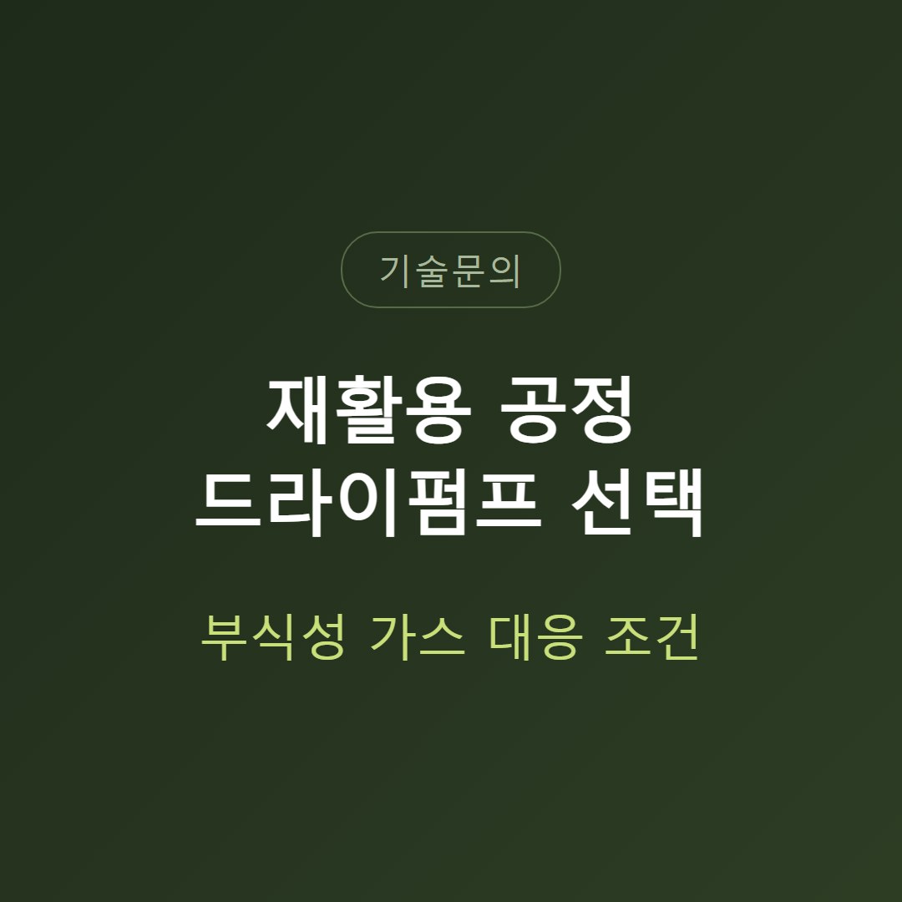
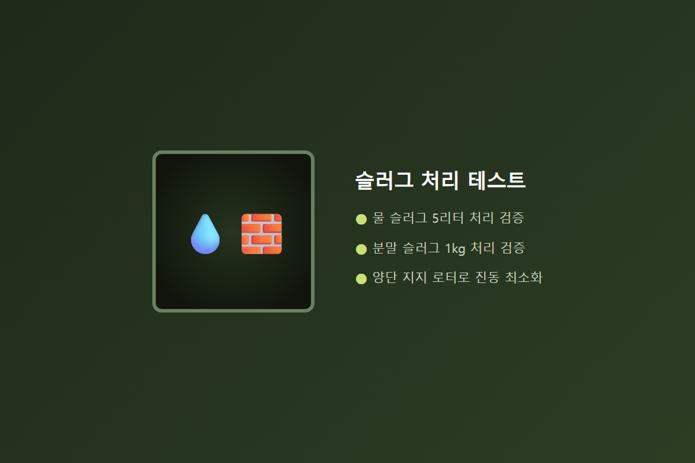
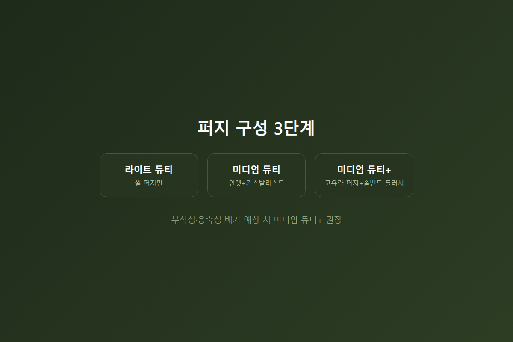
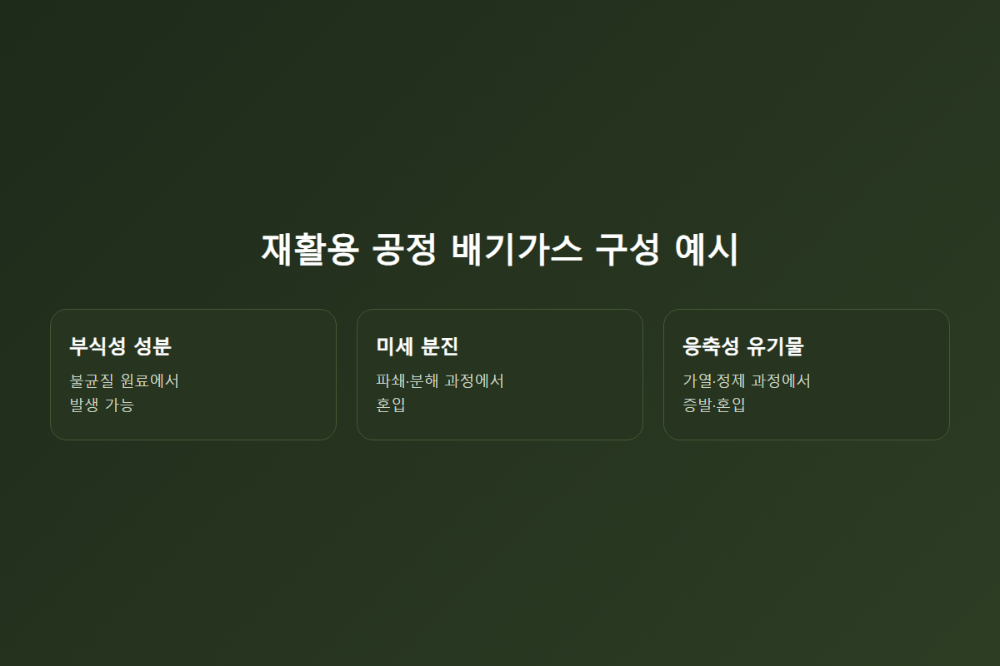

<!-- 수치검증: A항목 2개 확인(GXS 슬러그 처리 테스트, 퍼지 구성 3단계) / B항목 0개 / C항목 1개 확인(GXS=드라이 스크류) / D항목 0개 / 삭제 0개 / 교체 0개 -->
---
category: 기술문의
---

# 재활용 공정 드라이펌프, 부식성 가스에 견디는 조건 정리

폐기물·재활용 라인에 진공펌프를 새로 도입하거나 기존 설비를 교체할 때 가장 자주 나오는 질문은 "원료가 매번 다른데 펌프가 정말 버텨줄까"입니다. 신재(新材) 원료를 다루는 일반 공정과 달리, 재활용 원료는 조성이 일정하지 않다는 것이 근본적인 차이입니다. 금속 스크랩 정제든, 폐윤활유 재생이든, 폐배터리 해체·건조든, 배기가스에 무엇이 섞여 나올지 정확히 예측하기 어렵습니다. 이런 환경에서는 펌프가 평균 조건이 아니라 최악 조건을 얼마나 견디는지가 관건입니다.

## 조건 1 — 액체·분말 슬러그 처리 능력

금속 스크랩을 진공유도용해나 진공아크정련으로 정제하는 과정, 혹은 폐배터리를 해체·건조하는 과정에서는 예상치 못한 액체나 분말이 순간적으로 배기 라인에 유입될 수 있습니다. 드라이 스크류 펌프 중에는 5리터 물 슬러그와 1kg 분말 슬러그 처리 테스트를 통과한 제품이 있는데, 이 정도 내구성이 있어야 재활용 공정 특유의 불규칙한 부하를 감당할 수 있습니다. 로터를 양쪽에서 지지하는 논-캔틸레버 구조는 외팔보 구조보다 진동이 낮고 기동 안정성이 높아, 부하가 들쭉날쭉한 재활용 공정에서 펌프 수명에 직접 영향을 줍니다.

## 조건 2 — 공정에 맞는 퍼지 구성 선택

드라이 스크류 펌프의 퍼지 가스 구성은 보통 라이트 듀티, 미디엄 듀티, 미디엄 듀티 플러스 세 단계로 나뉩니다. 미디엄 듀티 플러스에는 정지 시 고유량 퍼지와 솔벤트 플러시 기능이 포함됩니다. 응축성·부식성 배기가 예상되는 재활용 공정이라면 표준 라이트 듀티보다 이 상위 구성을 선택하는 것이 안전합니다. 표준 구성으로 설치했다가 공정 중 부식·응축 문제가 반복된다면, 퍼지 구성 업그레이드부터 검토하는 것이 순서입니다.

## 오일이 없다는 것의 의미

폐윤활유나 폐용제를 다루는 공정에서 오일식 펌프를 쓰면, 처리 대상 물질이 펌프 자체 오일을 오염시킬 위험이 있습니다. 무급유(오일리스) 구조의 드라이펌프는 이 문제 자체가 구조적으로 발생하지 않습니다. 처리 대상이 이미 오염 물질인 재활용 공정에서는 이 차이가 특히 크게 작용합니다. 오일 교환이나 오염된 오일 폐기 절차 자체가 없어지는 것도 재활용 라인 운영자 입장에서는 관리 부담을 줄이는 요소입니다.

## 재활용 공정에서 진공이 쓰이는 대표 지점

폐기물·재활용 라인에서 진공이 쓰이는 대표적인 지점은 금속 스크랩 정제(진공유도용해·진공아크정련), 폐윤활유·폐용제 진공증류, 폐배터리 해체·건조 공정입니다. 이 공정들은 일반 금속 열처리·정제 공정과 진공 요건 자체는 크게 다르지 않지만, 유입되는 원료의 성상이 훨씬 불균질하다는 점에서 펌프 선정 기준이 더 까다로워집니다. 같은 설비라도 어떤 배치(batch)의 원료를 처리하느냐에 따라 배기가스 성분이 매번 조금씩 달라질 수 있다는 점을 감안해야 합니다.

## 도입 전 함께 점검할 것들

퍼지 구성을 상위 등급으로 올린다고 해서 모든 부식성 문제가 저절로 해결되는 것은 아닙니다. 배관 재질, 인렛 필터 유무, 배기 후단의 응축 방지 대책까지 함께 봐야 실제 현장에서 문제가 재발하지 않습니다. 특히 재활용 라인은 신규 설치보다 기존 설비를 증설하거나 원료 종류를 바꾸는 경우가 많아서, 처음 설계할 때 예상하지 못했던 부하가 뒤늦게 나타나기도 합니다.

이럴 때는 펌프만 교체하기보다 배기 계통 전체를 다시 점검하는 편이 낫습니다. 인렛 필터가 없다면 분진 유입을 1차로 막아주는 장치를 추가하는 것만으로도 펌프 수명이 크게 달라질 수 있습니다. 배관 재질이 부식성 가스에 취약한 소재라면, 펌프 스펙을 아무리 올려도 배관 쪽에서 먼저 문제가 생길 수 있다는 점도 함께 고려해야 합니다.

## 선정 체크리스트

- **원료 불균질성**: 최악 조건 기준으로 슬러그 처리 능력 확인
- **로터 구조**: 양단 지지 구조로 진동·기동 안정성 확보
- **퍼지 구성**: 부식성·응축성 배기 예상 시 상위 구성(미디엄 듀티+) 선택
- **오일 오염 리스크**: 무급유 구조로 원천 차단
- **향후 원료 확대 가능성**: 여유 용량을 감안한 배기 계통 사전 설계

재활용 공정은 원료가 매번 다르다는 전제를 안고 설계해야 합니다. 최악 조건에서도 버티는 슬러그 처리 능력, 안정적인 로터 구조, 공정에 맞는 퍼지 구성을 갖춘 드라이펌프라면 재활용 라인에서도 안정적으로 운용할 수 있습니다.

라인을 처음 설계하는 단계라면 예상되는 원료 종류를 최대한 폭넓게 나열해두고, 그중 가장 까다로운 조건을 기준으로 펌프와 퍼지 구성을 정하는 것이 안전합니다. 이미 가동 중인 라인에서 펌프 고장이 잦다면, 스펙을 올리기 전에 실제로 어떤 원료가 언제 배기가스 문제를 일으켰는지부터 되짚어보는 것이 우선입니다. 원인을 특정하지 않고 상위 사양으로만 교체하면 비용은 늘어나는데 같은 문제가 반복될 수 있습니다.

재활용 산업은 원료 수급 상황에 따라 처리 대상이 계속 바뀔 수 있다는 특성도 있습니다. 지금 당장의 원료뿐 아니라, 향후 취급 원료가 확대될 가능성까지 염두에 두고 펌프와 배기 계통 여유 용량을 검토해두면 나중에 설비를 다시 뜯어고치는 부담을 줄일 수 있습니다.

---

재활용 원료 종류와 배기가스 예상 성분, 향후 취급 원료 확대 계획을 알려주시면 적합한 퍼지 구성과 드라이펌프 모델을 함께 검토합니다. 부식성·응축성 배기 이력이 있는 라인은 기존 설비 사양과 인렛 필터·배관 재질까지 함께 확인합니다.
