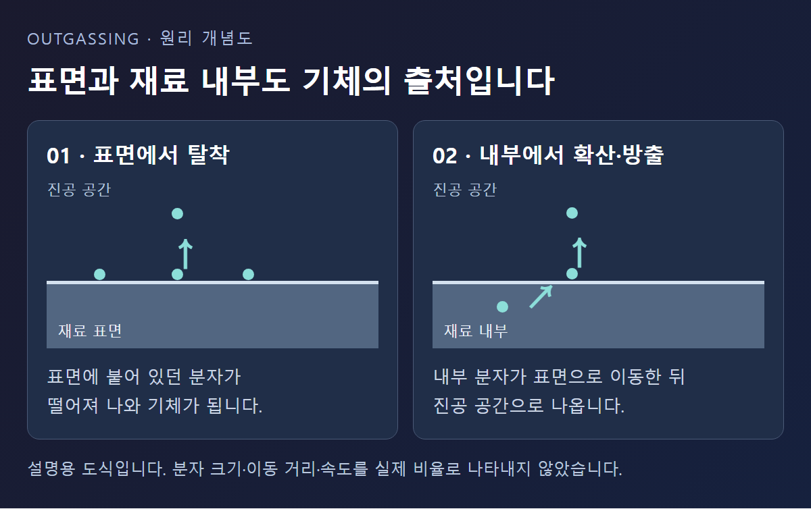
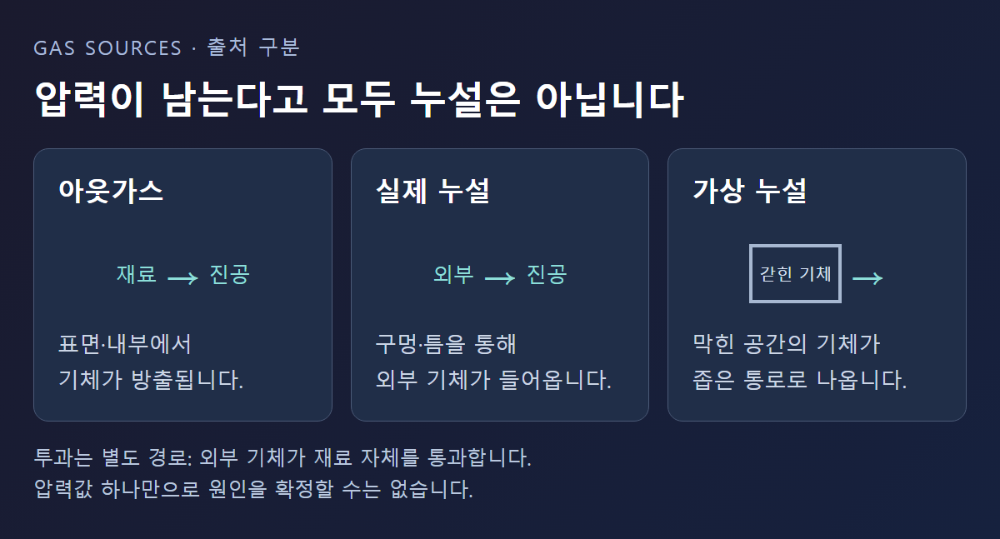
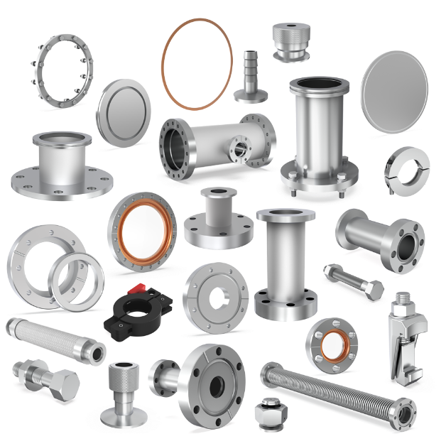
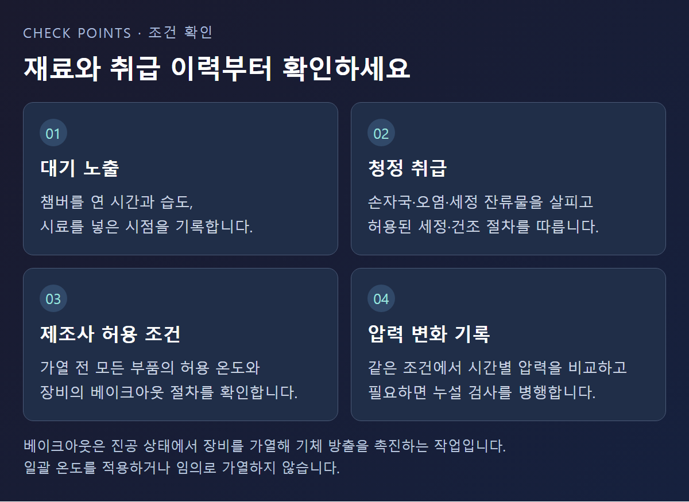

<!-- 검수: 운전 수치·제품 조합 미사용 / 공식 자료 8종 대조 / 실제 고객 사례 미사용 -->

# 진공 챔버 아웃가스, 계속 나오는 기체의 원인

아웃가스는 진공 챔버의 벽과 내부 부품에서 기체나 증기가 방출되는 현상입니다. 챔버 안의 공기를 빼낸 뒤에도 표면과 재료에서 기체가 공급되면 압력이 천천히 내려갈 수 있습니다. 다만 비슷한 증상은 실제 누설이나 갇힌 공간에서도 생깁니다. 압력값 하나로 펌프 고장이나 아웃가스를 확정하기 전에 기체의 출발점을 구분해야 합니다. [아웃가스 정의와 영향 요인 — Leybold](https://www.leybold.com/en/knowledge/vacuum-fundamentals/fundamental-physics-of-vacuum/outgassing-and-the-mean-free-path)

## 챔버를 비웠는데 왜 계속 기체가 나오나요?

처음 챔버를 열었을 때 빈 공간을 채운 공기와 내벽에 붙은 분자는 서로 다른 상태입니다. 펌프로 공간의 기체를 빼더라도 표면에 붙은 분자까지 한꺼번에 사라지는 것은 아닙니다. 내부 표면적, 재료, 표면 상태와 배기 경과 시간이 기체 방출량에 영향을 줍니다.

따라서 챔버 부피와 펌프 모델이 같아도 배기 결과가 같다고 보장할 수 없습니다. 내부 지그와 부품 구성이 달라졌다면 기체를 내놓는 표면도 바뀌기 때문입니다. 이는 위 영향 요인을 설비 비교에 적용한 해석입니다.

챔버의 압력에는 들어오거나 방출되는 기체의 양과 실제 배기 능력이 함께 작용합니다. 아웃가스로 공급되는 기체와 배출되는 기체가 균형을 이루면 압력 하강이 더뎌질 수 있습니다. 펌프 카탈로그의 도달 압력만으로 설치된 챔버의 압력을 판단하기 어려운 이유입니다. [가스 부하와 배기 능력 — Pfeiffer Vacuum](https://www.pfeiffer-vacuum.com/api/empolis/resource/environment/project1_p/documents/pfeifferSharepointProd/12438-article-uhv-chambers.pdf)

## 탈착·확산·기화는 무엇이 다른가요?

**탈착**은 표면에 붙어 있던 분자가 떨어지는 과정입니다. 대기 중 수분 등이 챔버 벽에 붙는 것을 흡착, 붙은 분자가 다시 기체로 나오는 것을 탈착이라고 합니다.

**확산**은 재료 내부의 기체가 표면 쪽으로 이동하는 과정입니다. 표면에 붙은 분자만 배출하는 상황과 달리 재료 내부도 기체 공급원이 됩니다. **기화**는 재료 자체나 휘발성 성분이 기체가 되는 과정입니다. 같은 아웃가스라도 어떤 경로가 중요한지는 재료와 처리 이력에 따라 다릅니다. [기체 방출의 경로 — Edwards](https://www.edwardsvacuum.com/content/dam/brands/edwards-vacuum/general-vacuum/gated-downloads/application-notes/3601-2171-01-outgassing.pdf)

표면이 깨끗해 보인다는 이유만으로 기체 방출이 없다고 판단해서는 안 됩니다. 외관에서 큰 오염이 보이지 않는 것과 표면에 분자가 남아 있지 않은 것은 다른 의미입니다. 이 점은 흡착·탈착의 원리를 부품 점검에 적용할 때 특히 유의할 부분입니다.

## 실제 누설·가상 누설·투과와는 어떻게 구분하나요?

실제 누설은 연결부의 틈이나 결함 같은 원하지 않는 통로로 기체가 들어오는 경우입니다. 가상 누설은 막힌 구멍이나 부품 사이 공간에 갇힌 기체가 챔버 안으로 천천히 풀려 나오는 경우입니다. 이 글에서는 가상 누설을 이러한 갇힌 공간의 방출로 구분합니다.

투과는 외부 기체가 고무 호스나 탄성체 씰의 재료 자체를 통과하는 경로입니다. 부품이 찢어지거나 연결부가 풀린 경우와는 다르므로, 투과를 곧바로 조립 불량으로 해석할 수 없습니다. [누설 유형과 투과의 구분 — Leybold](https://www.leybold.com/en-us/knowledge/vacuum-fundamentals/leak-detection/definition-and-measurement-of-vacuum-leaks)

원인을 나누는 목적은 점검 대상을 정하는 데 있습니다. 표면 방출이 의심되면 재료와 청정 상태를, 실제 누설이 의심되면 연결부와 기밀 상태를, 가상 누설이 의심되면 갇힌 공간의 구조를 검토하게 됩니다. 명칭만 바꿔 같은 처방을 적용해서는 원인 확인에 도움이 되지 않습니다.

## 새 부품을 넣은 뒤 배기가 느려졌다면 무엇을 보나요?

세정·건조가 끝난 부품도 취급하거나 보관하는 동안 다시 오염될 수 있습니다. 기름, 가공 잔류물, 지문과 습기 노출은 확인할 대상입니다. 세정제를 바꾸거나 그리스를 추가하기 전에 해당 재료와 장비에 허용된 방법인지 확인해야 합니다. [세정과 청정 취급 — Edwards](https://www.edwardsvacuum.com/content/dam/brands/edwards-vacuum/general-vacuum/gated-downloads/application-notes/3601-2181-01-four-ways-reduce-outgassing.pdf)

챔버 몸체 외에도 새 씰, 호스, 내부 지그의 재료와 표면 상태를 함께 살펴야 합니다. 금속 부품만 확인하고 작은 비금속 부품을 빠뜨리지 않도록 구성 목록과 세정 이력을 대조합니다. 내부 장착물도 기체 방출에 기여하므로 사진 한 장만으로 방출량이나 결함을 확정하기는 어렵습니다.

반복적으로 챔버를 대기에 개방하는 설비에서는 다시 채우는 기체와 보관 조건도 검토할 수 있습니다. 건조 가스를 이용한 퍼지·벤트는 수분 유입을 줄이는 데 활용되지만, 가스 종류와 공급 방법은 설비가 허용하는 절차에 맞아야 합니다. [수분 유입 관리 — Leybold](https://www.leybold.com/en/knowledge/blog/how-to-reduce-outgassing-in-vacuum-systems)

## 베이크아웃은 온도를 높일수록 좋은가요?

가열 배기인 베이크아웃은 붙어 있던 기체의 방출을 촉진하는 방법입니다. 가열 중에는 압력이 오를 수 있어 상승 자체만으로 실패라고 판단하지 않습니다. 그렇다고 온도를 계속 높여도 된다는 뜻은 아닙니다.

챔버 몸체, 씰, 뷰포트, 케이블과 내부 부품의 허용 조건을 모두 확인해야 합니다. 챔버가 견디는 온도를 연결된 펌프에도 그대로 적용할 수 없으며, 터보분자펌프가 연결된 경우 입구로 들어오는 복사열도 고려 대상입니다. [베이크아웃의 구성품·펌프 제한 — Edwards](https://www.edwardsvacuum.com/en-ca/vacuum-pumps/knowledge/applications/three-factors-to-consider-when-performing-a-system-bake-out)

장비와 처리 대상이 바뀌면 허용 조건도 달라집니다. 따라서 이 글에서는 공통으로 적용할 가열 온도나 시간을 제시하지 않습니다. 담당자는 장비별 절차와 공정에서 남은 물질을 확인한 뒤 가열 배기의 적용 여부를 정해야 합니다.

## 압력 변화 기록으로 어디까지 알 수 있나요?

압력 상승 시험에서는 펌프로부터 격리한 공간의 압력이 시간에 따라 어떻게 변하는지 살핍니다. 벽면에서 나오는 기체의 영향은 시간이 지나며 줄어드는 경향을 보일 수 있고, 일정한 실제 누설은 지속적인 압력 상승을 만들 수 있습니다. 실제로는 두 현상이 함께 나타나므로 곡선 모양만으로 원인을 분리하기 어려울 수 있습니다. [압력 상승 시험의 해석과 한계 — Leybold](https://www.leybold.com/content/leybold/en-us/knowledge/vacuum-fundamentals/leak-detection/pressure-rise-and-drop-tests.html)

이는 펌프를 계속 가동하며 압력 하강을 보는 기록과 구분해야 합니다. 운전 상태가 다른 두 기록을 같은 시험 결과처럼 비교하면 해석이 어긋납니다. 실제 시험의 밸브 조작과 격리 절차는 장비 담당자가 해당 설비의 절차에 따라 수행해야 합니다.

원인 검토를 위해 아래 정보를 함께 남기는 방식을 제안합니다.

- **변경 이력:** 챔버를 연 시점, 추가·교체한 부품과 위치, 세정·건조 방법
- **비교 조건:** 사용한 게이지, 압력 단위, 펌프 운전 여부, 온도 상태
- **시간별 결과:** 배기를 시작한 시점과 압력 변화, 이전에 같은 조건에서 얻은 기록
- **검사 구분:** 일반 배기 기록인지 압력 상승 시험인지, 별도 누설 검사 결과가 있는지

이 목록은 제조사의 공통 판정표가 아닌 비교 기록 제안입니다. 새 부품을 넣은 시점과 압력 변화가 겹치더라도 그 부품을 원인으로 확정하지 않습니다. 변경 이력과 측정 조건을 정리해 설비 담당자의 추가 검사에 활용하는 것이 목적입니다.

---

아웃가스 점검에는 재료·청정 상태·운전 이력을 함께 확인해야 합니다. 세정과 가열 배기는 각 구성품의 허용 조건 안에서 검토합니다.
