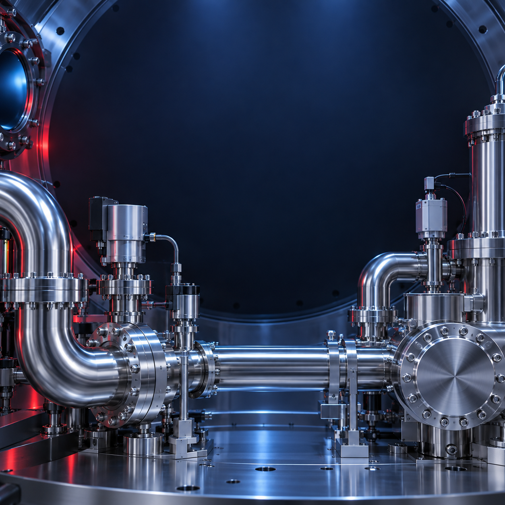
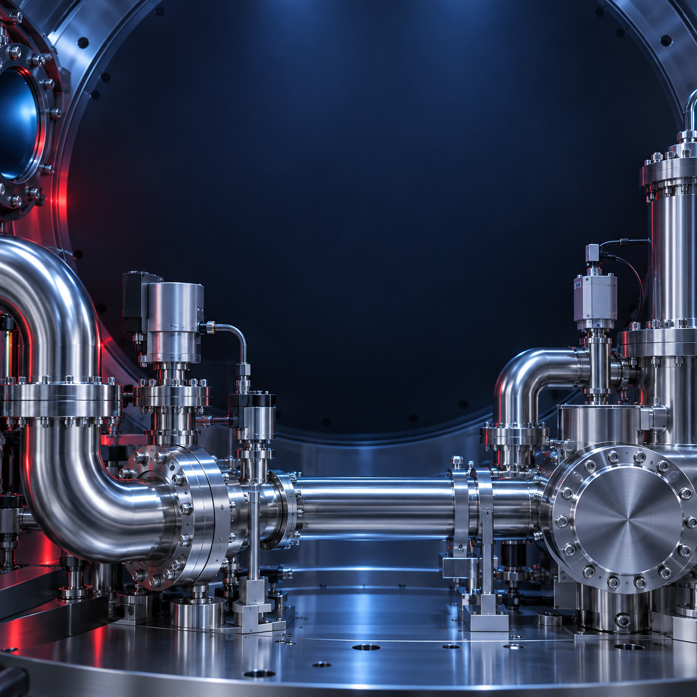
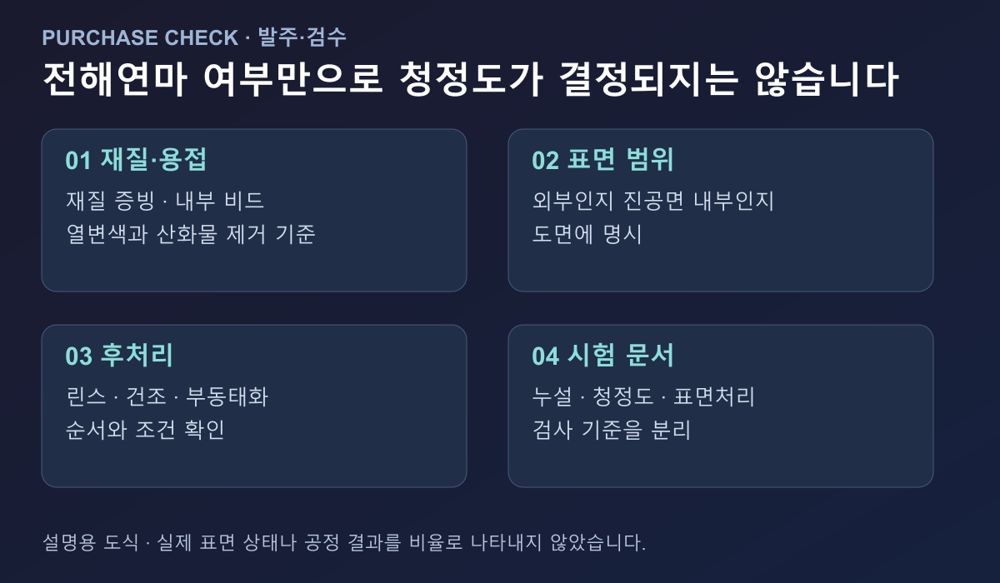
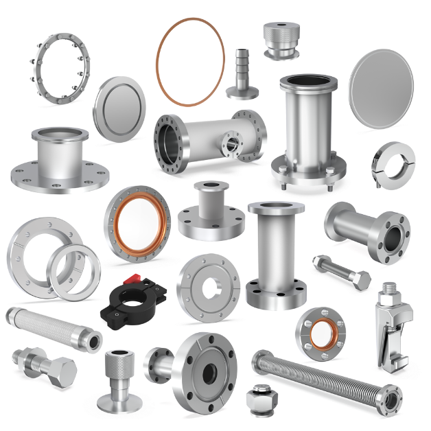

# 반도체 진공 배관, 전해연마 표면은 언제 필요할까?

반도체 공정용 진공 배관에 전해연마를 적용할지는 “표면을 더 반짝이게 만들 것인가”가 아니라, 진공에 노출되는 내부 표면을 어느 수준으로 관리해야 하는가로 판단해야 합니다. 파티클과 금속 오염에 민감한 공정, 세정·검수 이력을 요구하는 라인, 배관 내부의 아웃가스가 공정 안정성에 영향을 주는 설비라면 전해연마를 우선 검토할 수 있습니다. 반대로 모든 배관에 일괄 적용하는 것은 적절하지 않을 수 있습니다.

## 전해연마는 표면에서 무엇을 바꾸나?

전해연마는 부품을 전기화학적으로 처리해 표면의 일부를 제거하는 방식입니다. 일반적인 연마처럼 눈에 보이는 광택만 만드는 공정으로 이해하면 부족합니다. [ASTM B912](https://store.astm.org/b0912-02r18.html)는 적절한 조건에서 전해연마와 스테인리스의 부동태화가 함께 일어날 수 있으며, 표면의 자유 철 제거와 표면 평활화가 내식성 개선에 연결될 수 있다고 설명합니다.

진공 배관에서는 내부 표면의 미세한 버, 가공 흔적, 열변색, 오염 잔류 가능성이 중요합니다. 표면이 거칠거나 틈이 많으면 세정액이 남거나 입자가 붙을 수 있고, 진공을 만들었을 때 표면에 흡착된 물질이 방출되는 면적도 커질 수 있습니다. 전해연마는 이런 표면 상태를 관리하는 방법 중 하나입니다.

다만 전해연마가 재질·용접·세정 문제를 모두 대신하지는 않습니다. 전해연마를 했더라도 용접부의 산화물이나 내부 이물, 세정 후 잔류물, 설치 중 손자국이 남으면 실제 청정도는 달라질 수 있습니다.

## 반도체 배관에서 우선 검토할 상황

### 1. 파티클과 금속 오염에 민감한 공정

공정 가스가 통과하는 배관 내부에서 입자나 표면 잔류물이 문제가 될 수 있다면, 외관보다 진공면의 표면 상태를 우선 확인해야 합니다. 전해연마 여부만 묻기보다 진공에 노출되는 구간 전체가 같은 기준으로 관리되는지 확인하는 것이 중요합니다. 직관뿐 아니라 엘보, 티, 리듀서, 밸브와 피팅의 내부 표면도 같은 검토 대상입니다.

### 2. 배관 교체 후 베이스 압력이나 오염이 달라진 경우

새 배관을 설치했는데 이전보다 압력 회복이 느리거나 공정 오염이 늘었다면, 펌프 용량만 먼저 의심하기보다 배관 표면·세정·건조·포장 이력을 살펴야 합니다. 전해연마는 이런 원인 중 표면 상태를 개선하는 선택지입니다. 하지만 실제 원인은 아웃가스, 가상 누설, 연결부 누설, 측정 위치 차이일 수 있으므로 압력값 하나만으로 전해연마 필요성을 확정해서는 안 됩니다.

### 3. 내부 청정도 문서가 필요한 경우

반도체 설비의 배관은 구매품 자체보다 납품 문서와 추적성이 중요할 때가 있습니다. 어떤 재질을 사용했는지, 내부까지 표면처리했는지, 후처리와 린스·건조를 어떻게 했는지, 청정 포장 상태로 출하했는지를 확인해야 합니다. 전해연마를 선택했다면 표면처리 범위와 검사 항목을 발주서·도면에 미리 적어야 공급업체와의 해석 차이를 줄일 수 있습니다.

## 전해연마가 항상 정답은 아닌 이유

공정의 진공 수준과 오염 민감도가 낮고, 표준 세정·건조만으로 요구 성능을 만족한다면 전해연마를 추가하지 않을 수 있습니다. 또한 전해연마를 적용해도 내부 형상이 복잡하거나 막힌 공간이 많으면 처리액·린스액의 배출과 건조가 별도 문제가 됩니다. 표면처리 방식은 배관 형상과 접근성까지 포함해 평가해야 합니다.

표면처리 후의 품질 기준도 구분해야 합니다. 전해연마는 표면 마감의 한 항목이고, 누설 시험은 연결부와 용접부의 기밀성을 확인하는 별도 시험입니다. 파티클 검사는 청정도와 관련된 별도 검증이며, 베이스 압력 측정은 시스템 전체의 결과를 보는 시험입니다. 하나의 인증서나 한 번의 검사로 모든 상태를 대신할 수 없습니다.

## 발주 전에 확인할 다섯 가지

1. **재질**: 진공에 노출되는 배관과 피팅의 재질·등급을 확인합니다.
2. **표면 범위**: 외부 표면만 처리하는지, 진공에 노출되는 내부까지 처리하는지 도면에 표시합니다.
3. **용접부**: 내부 비드, 열변색, 산화물 제거 방법과 검사 범위를 확인합니다.
4. **후처리와 포장**: 전해연마 뒤 린스·건조·부동태화·청정 포장이 어떤 순서로 이뤄지는지 확인합니다.
5. **시험 문서**: 누설 시험, 청정도 검사, 표면처리 증빙을 각각 어떤 형식으로 받을지 합의합니다.

[Edwards의 진공 시스템 기술자료](https://www.edwardsvacuum.cn/content/dam/brands/edwards-vacuum/general-vacuum/gated-downloads/application-notes/3601-2181-01-four-ways-reduce-outgassing.pdf)는 표면처리와 세정이 아웃가스 관리의 일부라고 설명하며, 처리 뒤의 취급과 수분 노출도 중요하게 다룹니다. 즉, 전해연마가 된 배관을 구매하는 것에서 끝나는 것이 아니라, 설치 전 보관과 설치 과정에서 표면을 다시 오염시키지 않는 절차까지 연결해야 합니다.

## 기존 플랜지 선택과는 다른 질문입니다

KF와 ISO-K처럼 연결 규격을 선택하는 문제는 배관을 어떻게 체결할지에 대한 질문입니다. 전해연마는 그 배관의 진공면을 어떤 상태로 납품·관리할지에 대한 질문입니다. 규격이 맞는 배관이라도 내부 표면, 용접부, 세정, 포장 기준이 공정 요구와 다를 수 있습니다. 반대로 전해연마가 된 배관이라도 플랜지·씰·밸브 사양이 맞지 않으면 시스템은 원하는 성능을 내기 어렵습니다.

따라서 반도체 진공 배관을 검토할 때에는 “전해연마 제품인가?”를 첫 질문으로 두기보다, 진공면의 청정도와 파티클 민감도, 공정 압력, 재질, 용접·세정 이력, 공급 문서 중 무엇이 핵심인지 먼저 정하는 편이 안전합니다. 그 기준이 정해지면 전해연마를 배관 전체에 적용할지, 특정 구간과 부품에 한정할지 판단하기 쉬워집니다.

배관의 진공 노출 구간과 공정 오염 허용 수준이 정해져 있다면, 해당 기준에 맞춰 표면처리 범위와 검수 문서부터 확인해 보시길 권합니다.
