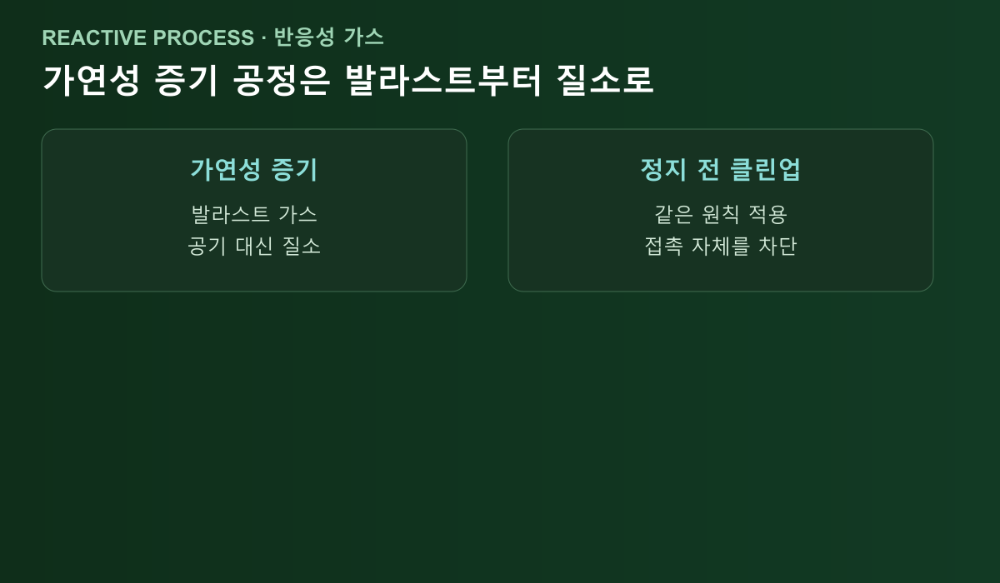

<!-- 수치검증: A항목 0개(스펙 수치 없음, 절차·원리 서술) / B항목 0개(해당없음, 조합추천 없음) / C항목 0개(해당없음, 특정모델 타입서술 없음) / D항목 0개(해당없음, 기능주장 없음) / 삭제 0개 / 교체 0개 -->

# 진공펌프를 끌 때 질소로 벤트해야 하는 이유

진공펌프를 끄는 순간 챔버·펌프 내부는 저온·저압 상태다. 이 상태로 그대로 공기에 노출되면 대기 중 수분이 차가운 내부 표면에 응축되기 쉬운 조건이 만들어진다. 그래서 정지 직전과 정지 직후 두 단계에서 각각 다른 목적으로 질소(불활성가스)를 쓴다. 정지 직전은 오일 속 콘덴세이트(응축수)를 빼내는 목적이고, 정지 직후는 보관 중 표면을 보호하는 목적이다.

## 끄기 전에 먼저 콘덴세이트부터 빼야 합니다

Edwards는 오일씰 로터리베인 펌프를 정지하기 전, 무부하(zero load) 상태에서 가스 발라스트 밸브를 열고 잠시 더 운전해 오일 속 콘덴세이트를 배출시키는 절차를 권장한다. 원문은 "run the pump (again on zero load with the gas ballast valve open, to purge the oil of condensates) before shutting down"이며, 이 절차를 거치면 부식 가능성이 크게 줄어든다고 설명한다. ([Edwards — 8 top tips for working with oil-sealed rotary vane pumps](https://www.edwardsvacuum.com/en-us/vacuum-pumps/knowledge/applications/working-with-oil-sealed-rotary-vane-pumps))

이 절차를 건너뛰고 전원부터 내리면, 오일에 남아있던 수분이 그대로 굳은 채 다음 가동까지 이어진다. 정지 전 마지막 몇 분을 투자하는 것과 다음 재가동 때 도달진공 회복이 늦어지는 것 중 어느 쪽이 더 비싼지는 이미 답이 나와 있는 셈이다.

## 응축이 왜 그렇게 문제가 되나요

수증기가 기체 상태 그대로 배출되지 않고 펌프 내부에서 액체로 응축되면, 다시 증발시켜야만 배기할 수 있어 도달진공 회복 시간이 훨씬 길어진다. Edwards는 이를 "Allowing water vapour to condense inside a pump will make the time to recover ultimate pressure much longer than if it remains in vapour phase because it has to be re-evaporated before it can be pumped out"로 설명한다. ([Edwards — How to pump condensable vapours?](https://www.edwardsvacuum.com/en-us/vacuum-pumps/knowledge/applications/how-to-pump-condensable-vapours))

Pfeiffer Vacuum도 같은 인과관계를 명시한다. "Condensate formation inside the pump increases the ultimate pressure, results in corrosion and at worst to total failure of the pump" — 응축이 도달압력 상승, 부식, 최악의 경우 펌프 고장까지 이어진다는 것이다. ([Pfeiffer Vacuum — Know-How, 4.7 Roots Vacuum Pumps](https://www.pfeiffervacuum.com/us/en/knowledge/vacuum-technology/knowledge-book/4-vacuum-generation/4_7_roots_vacuum_pumps/))

## 정비 전 퍼지와 보관 중 벤트는 목적이 다릅니다

"질소를 쓴다"는 결론은 같아도 상황마다 목적이 다르다. 이 셋을 구분하지 않고 뭉뚱그리면 절차를 잘못 적용하기 쉽다.

- **정비 작업 시작 전**: Edwards 안전 매뉴얼은 "Vent and purge the pumping system with nitrogen before starting maintenance work"라고 명시한다. 정비 중 잔류 유해가스에 작업자가 노출되지 않도록 하는 목적이다. ([Edwards — Vacuum Pump and Vacuum Systems SAFETY MANUAL](https://www.edwardsvacuum.com/content/dam/brands/edwards-vacuum/edwards-website-assets/corporate/documents/edwards-vacuum-safety-booklet.pdf))
- **정지 후 단기 보관·출하**: Pfeiffer는 루츠 펌프 기준으로 "the suction chamber can be phosphated, vented with nitrogen and vacuum sealed in order to provide short-term surface protection, e.g. for warehousing and shipment"라고 설명한다. 정지 직후 내부를 질소로 채워 밀봉하면 보관 중 표면이 공기 중 수분에 노출되지 않는다. ([Pfeiffer Vacuum — Know-How, 4.7 Roots Vacuum Pumps](https://www.pfeiffervacuum.com/us/en/knowledge/vacuum-technology/knowledge-book/4-vacuum-generation/4_7_roots_vacuum_pumps/))
- **가동 중 축 관통부(shaft feedthrough) 보호**: 이건 정지와 무관하게 가동 중에도 적용되는 항목이다. Pfeiffer는 "Inert gases, mostly nitrogen (N2), are used as the sealing gas"라며, 작동실과 기어실 사이 축 관통부에 실링가스를 넣어 윤활유 희석과 가스 침투 위험을 줄인다고 설명한다. ([Pfeiffer Vacuum — Know-How, 4.7 Roots Vacuum Pumps](https://www.pfeiffervacuum.com/us/en/knowledge/vacuum-technology/knowledge-book/4-vacuum-generation/4_7_roots_vacuum_pumps/))

## 가연성·반응성 증기를 다뤘다면 발라스트 가스부터 질소로

"When pumping potentially flammable vapours inert gas such as nitrogen should be used as the ballast gas"라는 원칙도 있다. ([Edwards — How to pump condensable vapours?](https://www.edwardsvacuum.com/en-us/vacuum-pumps/knowledge/applications/how-to-pump-condensable-vapours)) 이는 "정지 후 벤트"가 아니라 "가동 중 가스 발라스트에 넣는 기체 종류"를 다루지만, 원리는 동일하다 — 반응성이 있는 기체 환경에서는 공기(산소·수분)와의 접촉 자체를 줄이는 방향으로 일관되게 움직여야 한다는 것이다. 반응성 가스를 다루는 공정이라면 정지 직전 클린업 운전 단계부터 발라스트 가스를 질소로 바꾸는 편이, 정지 후 벤트만 질소로 하고 그 전 단계는 공기로 두는 것보다 일관된 절차다.

## 정리하면

정지 전에는 가스 발라스트를 열고 무부하로 돌려 콘덴세이트를 먼저 빼고, 정지 직후 장기간 세워둘 예정이거나 출하·보관이 목적이라면 내부를 질소로 채워 밀봉하는 순서다. 정비 작업이 예정돼 있다면 그 전에 별도로 질소 벤트·퍼지 절차를 거쳐야 한다. 반응성·가연성 가스를 다룬 라인이라면 이 세 단계 모두에서 공기 대신 질소를 기본값으로 삼는 편이 안전하다. 구체적인 벤트 밸브 조작 방법과 시간은 모델별 매뉴얼의 정지 절차를 따라야 하며, 이 글은 그 절차가 왜 필요한지의 원리를 정리한 것이다.

---

정지 전 콘덴세이트 배출 절차, 보관용 질소 벤트 구성 상담 가능. 반응성·가연성 가스를 다루는 라인은 모델별 정지 절차와 발라스트 가스 종류를 함께 확인해야 한다.
