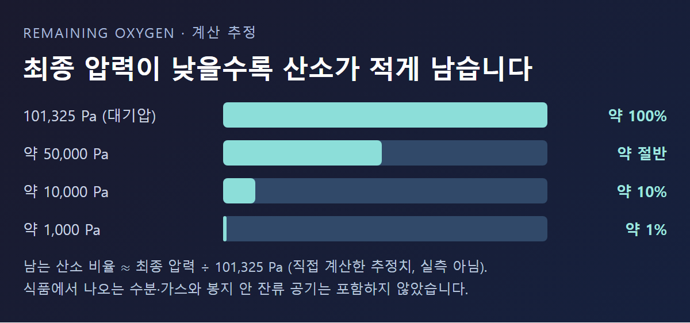
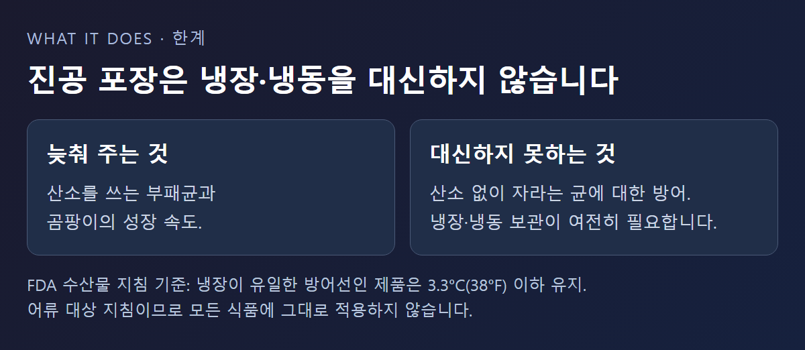

<!-- 수치검증: A항목 3개 확인(101,325 Pa·계산값 10%·1%) / B항목 0개(조합추천 없음) / C항목 0개(모델 타입 서술 없음) / D항목 0개(기능주장 없음) / 삭제 3개(3~5배 보관기간·완전 진공 표현·가정용 기기 수치) / 교체 0개 -->

# 진공 포장기는 어떻게 공기를 빼고, 왜 음식이 오래갈까

진공 포장은 봉지 안 공기를 빼고 밀봉해 산소를 줄이는 방식이다. 산소를 쓰며 자라는 부패 요인의 성장을 늦추는 것이 목적이다. 다만 봉지 안이 완전한 진공이 되는 것은 아니고, 진공 포장이 냉장·냉동을 대신하지도 못한다. 이 글은 포장기 한 사이클에서 실제로 일어나는 일과, 남는 산소가 얼마인지 계산하는 방법, 그리고 진공 포장이 못 하는 것을 정리한다.

## 진공 포장기 한 사이클에서 일어나는 일

Atlas Copco는 진공 포장의 기본을 "포장하기 전에 봉지에서 공기를 빼고 밀봉하는 것"으로 설명한다. 플라스틱 필름 봉지에 제품을 넣고, 안의 공기를 빼고, 밀봉하는 순서다. ([Atlas Copco — vacuum packaged food](https://www.atlascopco.com/en-us/vacuum-solutions/blog/vacuum-packaged-food))

산업용 포장은 크게 세 방식으로 나뉜다. 필름을 열로 수축시키는 슈링크, 필름이 제품 표면을 감싸는 스킨 포장, 공기를 뺀 뒤 CO₂·질소 등 혼합가스를 채우는 MAP(가스 치환 포장)다. MAP은 공기를 빼는 것과 가스를 채우는 것이 한 세트여서 열성형기나 트레이 실러 같은 설비에서 쓴다. 회전식(캐러셀) 포장기는 처리량이 가장 높아 큰 육류 덩어리나 치즈 포장에 쓴다고 Leybold는 설명한다. ([Leybold — Food Packaging](https://www.leybold.com/en/applications-and-industries/food-processing-and-packaging/food-packaging))

밀봉이 끝나고 마지막에 바깥 공기가 들어오면, 봉지 안은 낮은 압력이고 바깥은 대기압이라 그 차이가 필름을 눌러 제품에 밀착시킨다. 예를 들어 봉지 안이 약 10,000 Pa라면 바깥과의 차이는 약 91,325 Pa이고, 이는 1cm²당 약 9.1N의 힘이다(직접 계산한 값). 봉지가 딱딱하게 조여지는 것은 이 압력 차 때문이며, 부서지기 쉬운 식품은 이 힘에 눌릴 수 있다.

## 공기를 얼마나 빼야 산소가 얼마나 남을까

표준 대기압은 101,325 Pa이다. ([NIST CODATA](https://physics.nist.gov/cgi-bin/cuu/Value?stdatm=)) 밀폐된 공간의 공기를 이상기체로 보면, 배기 후 남는 산소의 비율은 대략 최종 압력을 101,325 Pa로 나눈 값이다.

이 값은 직접 계산한 추정치이며 특정 기기의 실측값이 아니다. 예를 들어 약 10,000 Pa까지 빼면 처음 산소의 약 10%가 남고, 약 1,000 Pa까지 빼면 약 1%가 남는다. 반대로 압력이 절반(약 50,000 Pa)에 머물면 산소도 절반 가까이 남는다. 이 계산에는 식품에서 나오는 수분과 가스, 봉지 안에 갇힌 잔류 공기가 들어 있지 않다. 그래서 "완전히 제거된다"는 표현은 실제와 맞지 않는다. 가정용 기기가 실제로 어디까지 빼는지는 이번 조사에서 확인하지 못해 수치를 싣지 않는다.

Leybold는 자사 펌프가 "밀봉 전 낮은 압력"을 만들어 식품 유통기한에 긍정적인 영향을 준다고 설명한다. 다만 더 낮은 압력까지 빼려면 배기 시간이 길어지고 펌프가 처리할 수증기도 늘어난다. 최종 압력, 사이클 시간, 식품의 수분은 서로 맞바꾸는 관계다.

## 수분 많은 식품은 배기 속도가 중요하다

압력이 낮아지면 물은 낮은 온도에서도 끓기 시작한다. 이 원리는 [진공에서는 물이 왜 낮은 온도에서 끓을까](https://www.smartechvacuum.com/blog/98) 글에서 자세히 다뤘다. 국물이나 양념이 묻은 식품을 진공 챔버에서 급하게 배기하면 봉지 안 액체가 끓어오르거나 거품이 일어 밀봉 부위를 오염시킬 수 있다. 그래서 수분이 많은 식품은 얼마나 빨리, 어느 압력까지 뺄지 조절할 수 있는지가 포장 품질에 영향을 준다. 이 조절 방식은 기기마다 다르므로 사용하는 포장기의 설명서를 확인해야 한다.

## 진공 포장이 못 하는 것

산소가 줄면 산소를 쓰는 부패균과 곰팡이의 성장이 느려진다. 하지만 산소 없이도 자라는 균은 그렇지 않다. 미국 FDA의 수산물 위해요소 지침은, 산소를 줄인 포장에서는 호기성 부패균의 성장이 느려지는 동안 보툴리눔 독소가 부패 징후 없이 만들어질 수 있다고 경고한다. 냉장만이 방어선인 제품은 포장부터 섭취까지 3.3°C(38°F) 이하를 유지하도록 한다. ([FDA — Chapter 13](https://www.fda.gov/files/food/published/Fish-and-Fishery-Products-Hazards-and-Controls-Guidance-Chapter-13-Download.pdf))

이 지침은 어류 제품에 대한 것이라 모든 가정용 식품에 그대로 옮길 수는 없다. 다만 "진공 포장했으니 실온에 두어도 된다"는 생각은 위험하다는 점은 분명하다. 진공 포장은 냉장·냉동을 보완할 뿐 대신하지 않는다.

## 포장기 안의 진공펌프는 무엇이 다를까

식품에는 수분이 많다. 배기 중 나온 수증기가 펌프 안에서 응축되면 오일과 섞여 윤활이 나빠진다. Leybold는 가스 발라스트가 압축이 끝나기 전에 소량의 공기를 넣어 압축비를 최대 10:1로 낮추고, 수증기가 응축되기 전에 밖으로 밀어낸다고 설명한다. 이 효과를 얻으려면 펌프가 운전 온도에 도달해 있어야 하고 발라스트 밸브가 열려 있어야 한다. ([Leybold — gas ballast](https://www.leybold.com/en-us/knowledge/vacuum-fundamentals/vacuum-generation/how-does-a-gas-ballast-work))

포장기용 펌프에는 오일 밀봉 로터리 베인 펌프와 건식 펌프가 모두 쓰인다. 건식은 산소 호환 오일이 필요 없고 유지보수 부담이 적다고 Leybold가 설명하는 반면, 오일식은 발라스트와 오일 관리가 성능을 좌우한다. 회전식 포장기는 펌프를 설비 가까이 두어 사이클마다 긴 배관을 다시 배기하지 않게 하면 처리량과 에너지 면에서 유리하다는 것도 같은 자료의 설명이다.

포장기용 진공펌프 검토와 별개로, 포장 상태가 들쭉날쭉하다면 밀봉부에 액체나 기름이 묻지 않았는지, 봉지 입구에 주름이 없는지, 배기 시간이 충분한지, 펌프 오일이 수분으로 탁해지지 않았는지를 차례로 확인한다.

포장 공정의 펌프를 검토한다면 처리하는 식품의 수분량, 한 사이클의 배기 시간, 요구하는 최종 압력을 먼저 정리한다. 이 세 가지를 알려주시면 적합한 구성을 함께 검토할 수 있다.

---

식품 포장 등 배기 공정의 펌프 선정, 가스 발라스트 운전 조건, 수분이 많은 공정의 오일 관리 상담 가능. 진공 포장은 냉장·냉동을 대신하지 않는다.
