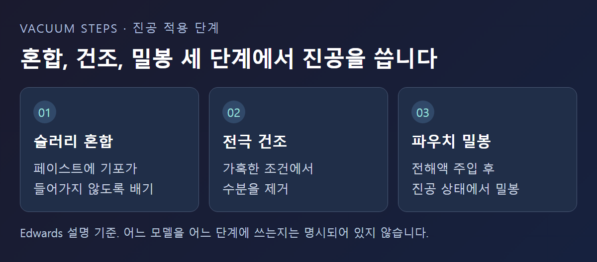
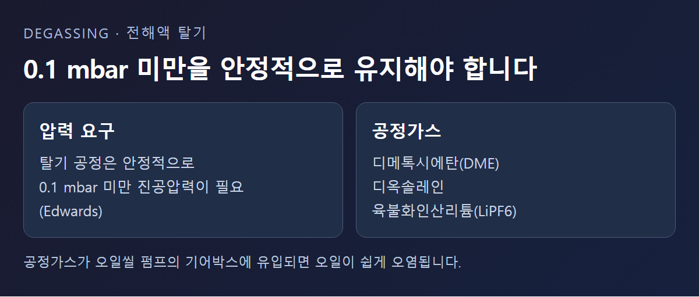
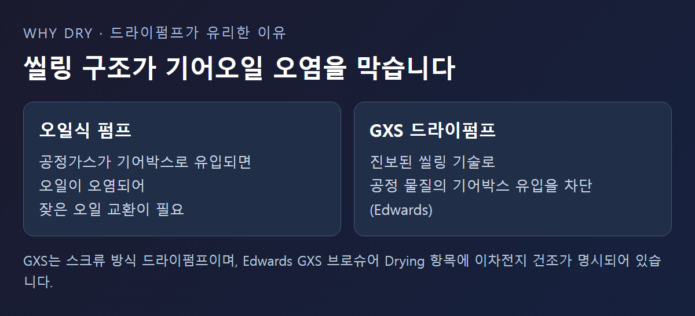

<!-- 수치검증: A항목 3개 확인(0.1 mbar·GXS 브로슈어 배기속도 표·오일량) / B항목 0개(공식 조합 미확인, 권장조합 표현 사용 안 함) / C항목 1개 확인(GXS=드라이 스크류, product_master_table 대조) / D항목 1개 확인(GXS 씰링 기술) / 삭제 2개(총소유비용 수치·특정모델 단정) / 교체 0개 -->

# 이차전지 건조·전해액 주입 공정의 드라이펌프 선택법

이차전지 제조는 슬러리 혼합부터 전극 건조, 전해액 주입 후 탈기, 파우치 밀봉까지 여러 단계에서 진공을 쓴다. 이 중 건조와 탈기 단계는 부식성 공정가스를 다루기 때문에 펌프 방식을 잘못 고르면 잦은 정비로 이어진다. 이 글은 어느 단계에 진공이 필요한지, 왜 오일식보다 드라이(오일 없는) 펌프가 유리한지를 Edwards 공식 자료 기준으로 정리한다.

## 이차전지 제조, 진공은 어디에 쓰일까

Edwards는 이차전지 제조의 진공 적용을 세 단계로 설명한다. 먼저 슬러리를 섞는 초기 혼합 단계에서 페이스트에 기포가 들어가지 않도록 진공을 적용한다. 다음으로 건조 단계에서는 매우 가혹한 조건에서 수분을 제거하는 데 진공을 쓴다. 마지막으로 전해액을 주입한 뒤 배터리 파우치를 실제로 밀봉하는 작업도 진공 상태에서 이뤄진다. ([Edwards — Lithium-Ion Battery Production](https://www.edwardsvacuum.com/en-us/vacuum-pumps/our-markets/energy-solutions/lithium-ion-battery-production))

이 페이지는 오일씰 로터리베인과 드라이펌프를 포함한 다양한 라인업이 있다고만 설명하고, 어느 모델을 어느 단계에 써야 하는지는 명시하지 않는다. 아래 내용은 그중 건조·탈기 단계에 해당하는 근거다.

## 전해액 탈기는 왜 압력 관리가 까다로울까

전해액을 채운 셀은 리튬 이온이 자유롭게 이동해야 충방전이 제대로 되는데, 이를 위해 탈기 공정에서 안정적으로 0.1 mbar 미만의 진공압력을 요구한다. 이 압력을 지속적으로 유지해야 하므로 펌프가 안정적으로 연속 운전할 수 있어야 한다. ([Edwards — Why are dry pumps better for Li-ion battery electrolyte degassing?](https://www.edwardsvacuum.com/en-us/knowledge/applications/why-are-dry-pumps-better-for-li-ion-battery-electrolyte-degassing))

전해액 관련 공정가스에는 디메톡시에탄(DME), 디옥솔레인, 육불화인산리튬(LiPF6) 등이 포함된다. 이런 물질이 오일씰 펌프의 기어박스로 들어가면 오일이 쉽게 오염되고, 그 결과 잦은 오일 교환으로 유지보수 비용과 가동 중단 손실이 커진다는 것이 Edwards의 설명이다.

## 드라이펌프가 유리한 이유

Edwards의 GXS 드라이 스크류 펌프는 공정 물질이 기어박스로 유입되는 것을 막는 진보된 씰링 기술을 갖춰 기어오일 오염 자체를 없앤다고 설명한다. 초기 구매 비용은 오일씰 펌프보다 높을 수 있지만, 오일 오염에 따른 반복 정비가 줄어 총소유비용 측면에서 유리하다는 것이 요지다. 다만 이 절감폭을 숫자로 제시한 자료는 확인하지 못해 이 글에는 정성적 설명만 담는다.

스마텍이 보유한 Edwards GXS 브로슈어에는 적용 공정 목록의 건조(Drying) 항목에 "Lithium-Ion battery drying"이 명시돼 있어, GXS 계열이 이 공정에 쓰이는 펌프라는 점은 제조사 문서로 확인된다. GXS는 스크류 방식 드라이펌프이며(제품군: 산업용 GXS Dry), 오일 로터리베인이나 루츠 부스터와는 압축 방식이 다르다.

## 조합·모델 선정은 왜 신중해야 할까

GXS는 단독형과 부스터(2600·4200 등)를 더한 조합형이 있다. 다만 이차전지 전해액 탈기 공정에 특정 GXS 부스터 조합을 "권장 조합"으로 명시한 이차전지 전용 공식 자료는 이번 조사에서 확인하지 못했다. 처리하는 셀 크기, 챔버 용적, 목표 사이클 시간에 따라 필요한 배기속도가 달라지므로, 일반 조합표만 보고 모델을 단정하기보다는 실제 공정 조건을 기준으로 확인하는 편이 안전하다.

## GXS 단독형과 부스터 조합형, 사양은 어떻게 다를까

스마텍이 보유한 Edwards GXS 브로슈어의 기술 사양표에는 GXS160 단독형의 최대 진공압력이 7×10⁻³ mbar(퍼지 없이)로, 여기에 1750 부스터를 더한 GXS160/1750 조합은 7×10⁻⁴ mbar로 더 낮은 압력까지 도달한다고 나와 있다. 오일은 두 구성 모두 PFPE 계열(Drynert 25/6)을 쓴다. 이 수치는 GXS 일반 사양이며, 이차전지 전해액 탈기 조건에서 실측한 값은 아니다. 부스터를 더하면 도달 압력이 낮아지는 대신 설치 공간과 초기 비용이 늘어나므로, 0.1 mbar 목표를 단독형으로 충분히 맞출 수 있는지부터 확인하는 편이 합리적이다.

이 사양표는 GXS250·450·750 등 더 큰 모델까지 각각 단독형과 부스터 조합형(2600·4200 등)을 갖추고 있어, 처리량이 커지는 라인에서도 같은 씰링 구조를 유지한 채 배기속도만 키울 수 있다는 점을 보여준다.

## 이미 쓰고 있는 오일식 펌프, 언제 점검해야 할까

전해액 라인에 오일식 펌프를 이미 쓰고 있다면 오일 색이 평소보다 빨리 탁해지거나, 오일 교환 주기가 눈에 띄게 짧아졌는지를 먼저 확인한다. 이런 변화는 공정가스가 기어박스 쪽으로 넘어오고 있다는 신호일 수 있다. 반대로 오일 상태가 안정적으로 유지되고 있다면 당장 드라이펌프로 바꿔야 한다는 뜻은 아니며, 현재 구성이 해당 공정가스와 잘 맞고 있다는 뜻으로 볼 수 있다.

## 도입 전 확인할 것과 도입 후 유지관리

새로 드라이펌프로 전환하는 라인이라면 배기 배관의 재질이 공정가스(DME·디옥솔레인·LiPF6)에 견디는지, 배기구 쪽 응축·부식 대책이 되어 있는지를 함께 확인한다. 도입 후에는 오일씰 방식과 달리 오일 교환 주기를 정비 지표로 쓸 수 없으므로, 씰 마모나 배기속도 저하를 확인하는 정기 점검 항목을 별도로 마련해 두는 편이 안전하다. 점검 주기와 항목은 모델별 매뉴얼의 정비 절차를 기준으로 정한다.

귀사 공정이 파우치형인지 각형인지, 챔버 용적과 목표 탈기 시간이 어느 정도인지 알려주시면 적합한 GXS 구성을 확인해 드린다.

---

이차전지 건조·전해액 탈기 공정의 GXS 드라이펌프 구성, 공정가스 대응 사양 상담 가능.
