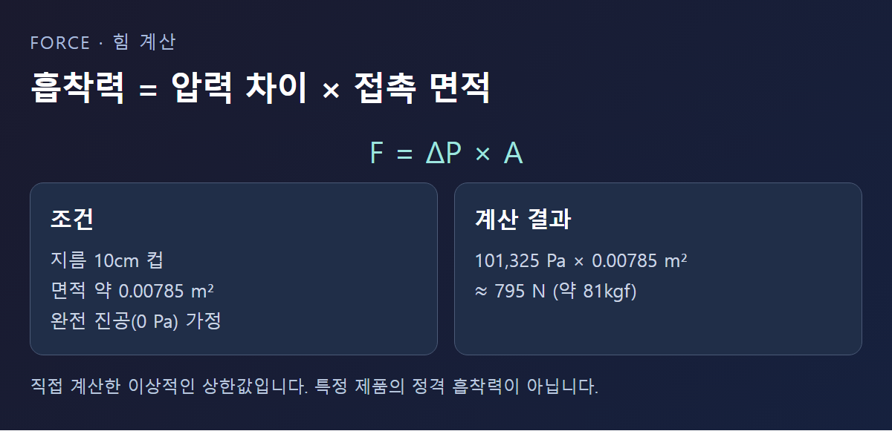

<!-- 수치검증: A항목 2개 확인(101,325 Pa·직접계산 795N) / B항목 0개(해당없음) / C항목 0개(해당없음) / D항목 0개(해당없음) / 삭제 2개(문어·게코 비유·특정제품 흡착력 스펙) / 교체 0개 -->

# 압착 컵이 벽에 붙는 원리 — 진공 흡착(석션컵·진공 그리퍼)

욕실 벽에 붙이는 흡착 후크부터 공장에서 유리판을 옮기는 로봇 팔의 흡착 손까지, 원리는 같다. 컵 안쪽 공기를 빼서 압력을 낮추면, 바깥의 대기압이 안쪽보다 세게 컵을 표면 쪽으로 민다. 이 글은 그 힘이 실제로 얼마나 되는지 계산해 보고, 산업용 흡착 장치는 이 압력을 어떻게 계속 유지하는지 정리한다.

## 흡착력은 압력 차이와 면적의 곱이다

컵을 표면에 누르면 안쪽 공기가 밀려나가 압력이 낮아진다. 이때 바깥쪽 대기압과 안쪽 압력의 차이(ΔP)에 컵의 접촉 면적(A)을 곱한 값이 표면을 미는 힘이 된다. 표준 대기압은 101,325 Pa다. ([NIST CODATA](https://physics.nist.gov/cgi-bin/cuu/Value?stdatm=))

직접 계산해 보면, 지름 10cm(반지름 5cm)인 원형 컵의 면적은 약 78.5cm²(0.00785 m²)다. 컵 안을 완전한 진공(0 Pa)까지 뺐다고 가정하면 최대 힘은 101,325 Pa × 0.00785 m² ≈ 795 N, 약 81kgf에 이른다. 이 값은 이상적인 상한선을 계산한 것이며, 실제로는 완전 진공에 도달하지 않고 틈으로 공기가 다시 들어오기 때문에 실제 힘은 이보다 작다. 특정 제품의 정격 흡착력이 아니라 물리 원리를 보여주는 계산 예시다.

압력 차이가 작아지면 힘도 그만큼 줄고, 컵 면적이 커지면 같은 압력 차이에서도 힘이 커진다. 큰 물체를 옮기는 산업용 흡착기의 컵이 유독 큰 이유가 여기에 있다.

## 표면이 매끄러워야 잘 붙는 이유

압착 컵이 유리나 타일에는 잘 붙고 거친 벽지나 콘크리트에는 잘 안 붙는 이유도 같은 원리로 설명된다. 표면이 거칠면 컵 테두리와 표면 사이에 완전히 밀착되지 않는 미세한 틈이 남고, 이 틈으로 공기가 서서히 다시 들어오면서 압력 차이가 줄어들어 흡착력이 떨어진다. 매끈한 표면일수록 이 틈이 작아 압력 차이가 오래 유지된다.

## 공기가 조금 남아도 흡착은 된다

완전한 진공(0 Pa)이 아니어도 흡착은 일어난다. 예를 들어 컵 안이 대기압의 절반인 약 50,663 Pa까지만 낮아져도, 압력 차이는 절반인 약 50,663 Pa이고 힘도 앞선 계산의 절반 수준인 약 397 N(약 40kgf)이 된다. 즉 반드시 완전 진공까지 뺄 필요는 없고, 옮기려는 물체의 무게에 맞는 만큼만 압력을 낮추면 된다. 다만 안전 여유를 두기 위해 실제 설계에서는 계산상 필요한 힘보다 몇 배 여유 있게 흡착력을 확보하는 것이 일반적이다.

## 산업 현장에서는 진공을 어떻게 계속 만들까

가정용 압착 컵은 손으로 누른 순간의 압력 차이만 이용하고 별도 장치가 없어, 시간이 지나면 흡착력이 자연히 줄어든다. 반면 로봇 팔이나 리프팅 장비처럼 지속적으로 물체를 붙잡아야 하는 산업 현장에서는 계속 공기를 빼주는 진공원이 필요하다.

이때 흔히 쓰이는 방식은 압축공기를 좁은 통로로 빠르게 흘려보내 옆 통로의 공기를 함께 빨아들이는 벤츄리 이젝터, 또는 별도의 진공펌프다. 압축공기 설비가 이미 있는 현장이라면 벤츄리 이젝터를 간단히 쓸 수 있고, 압축공기 없이 더 큰 유량을 지속적으로 빼야 한다면 전용 펌프를 쓴다는 것이 업계에서 일반적으로 설명하는 방식이다. 이 구분은 개념적인 설명이며, 정량적인 성능 비교 자료는 이번 조사에서 확인하지 못했다.

## 컵 하나보다 여러 개를 쓰는 이유

무거운 유리판이나 넓은 철판을 옮길 때는 큰 컵 하나 대신 여러 개의 작은 컵을 나눠 붙이는 경우가 많다. 이유는 두 가지다. 첫째, 필요한 흡착력은 컵 여러 개의 힘을 더해 확보할 수 있어 한 개의 큰 컵을 만드는 것보다 설계가 단순해진다. 둘째, 컵 하나가 표면 결함이나 이물질 때문에 밀착에 실패해도 나머지 컵들이 물체를 붙잡고 있어 안전 여유가 생긴다. 판이 휘어 있거나 표면이 평평하지 않을 때도 여러 개의 컵이 각각 국소적으로 밀착하는 편이 유리하다.

물체의 무게 중심과 컵의 배치도 중요하다. 무게 중심이 한쪽으로 치우친 상태에서 컵을 반대쪽에만 배치하면, 계산상 흡착력의 합이 충분해도 물체가 기울어지며 한쪽 컵에서 먼저 밀착이 풀릴 수 있다. 그래서 산업용 흡착 설비는 무게 중심 주변에 고르게 컵을 배치하는 것을 기본 원칙으로 삼는다.

## 흡착이 갑자기 풀리면 위험할 수 있다

무거운 물체를 흡착으로 들어 옮기는 장비는 진공원이 갑자기 멈추는 상황에 대비해야 한다. 일부 장비는 진공을 잠시 저장해 두는 예비 탱크와, 진공원이 멈춰도 저장된 진공이 빠져나가지 않게 막는 밸브를 두어 물체를 천천히 내려놓을 시간을 번다는 방식이 일반적으로 알려져 있다. 이는 업계에 널리 알려진 설계 개념이며, 특정 제품의 실제 탑재 기능으로 단정하지는 않는다.

## 지속적인 진공이 필요하다면 확인할 점

이 글에서 다룬 벤츄리 이젝터는 압축공기를 이용하는 별도 방식이고, 취급되는 오일로터리펌프·드라이펌프·스크롤펌프는 전기로 구동해 지속적으로 공기를 배기하는 전용 진공펌프에 해당한다. 흡착 유량이 크거나 압축공기 설비 없이 안정적인 진공을 오래 유지해야 하는 현장이라면 전용 펌프 방식을 검토하는 편이 낫다. 다만 진공 그리퍼·리프팅 장비 전용 제품을 스마텍이 직접 취급한다는 근거는 이번 조사에서 확인하지 못했으므로, 구체적인 기종 추천은 이 글에서 다루지 않는다. 실제 유량·압력 조건이 있다면 별도로 확인하는 편이 정확하다.

흡착 방식 장비를 다룰 때는 이런 예비 대책이 있는지, 흡착력이 계산상 최대치가 아니라 실제 표면 상태에서 얼마나 나오는지를 먼저 확인하는 편이 안전하다.

---

진공 발생 방식(펌프·이젝터)과 압력 유지 조건에 대한 기술 상담 가능.
