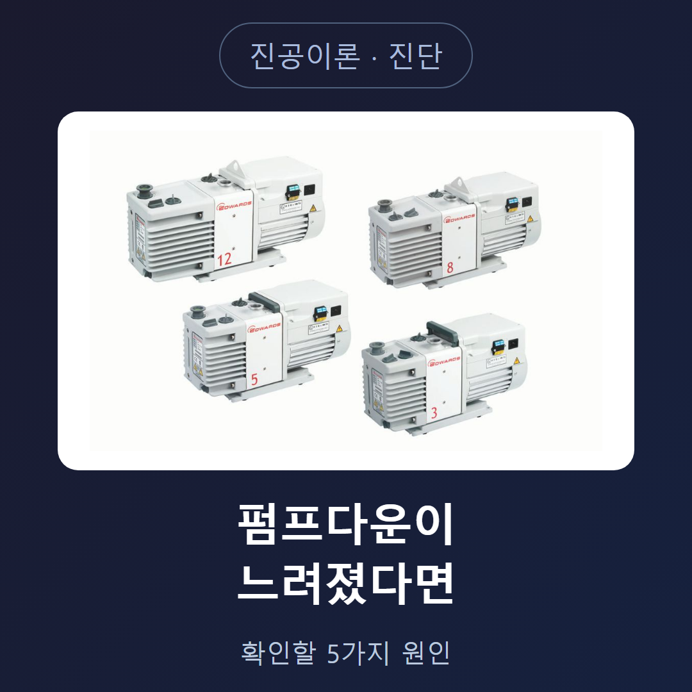

<!-- 수치검증: A항목 1개 확인(아웃가스 감소율 50%~10만배) / B항목 0개(해당없음) / C항목 0개(해당없음) / D항목 0개(해당없음) / 삭제 1개("오일80%·누설15%·마모5%" 비공식 수치) / 교체 0개 -->

# 펌프다운 시간이 예상보다 길어지는 이유 5가지

평소보다 진공에 도달하는 시간이 길어졌다면 원인은 대개 한 가지가 아니라 여러 가지가 겹쳐 있다. 이 글은 Edwards·Leybold 공식 자료를 기준으로, 펌프다운이 느려질 때 순서대로 확인할 다섯 가지 원인을 순서대로 정리한다.

## 원인 1 — 가스 발라스트 밸브가 열려 있다

스마텍이 Edwards 자료(Why Your Vacuum Pump Keeps Failing, https://www.edwardsvacuum.com/en-us/vacuum-pumps/knowledge/applications/whyyourvacuumpumpkeepsfailing-6commonmaintenancemistakes)를 확인한 결과, 펌프가 도달압력에 이르지 못하는 가장 흔한 원인은 가스 발라스트 밸브가 열려 있는 상태로 확인된다. 밸브가 열려 있으면 펌프는 절대 도달압력에 이르지 못한다.

발라스트는 수증기가 많은 공정을 처리할 때 일부러 여는 밸브다. 그 공정이 끝난 뒤 닫는 것을 잊으면 이후 배기할 때마다 압력이 매번 계속 높게 남는다. 펌프다운이 느려졌다면 가장 먼저 확인할 항목이다.

## 발라스트 밸브, 어떻게 확인할까

발라스트 밸브는 대개 펌프 몸체에 별도 손잡이나 다이얼로 달려 있다. 최근에 수분이 많은 가스를 처리했거나, 여러 사람이 같은 장비를 쓰는 현장이라면 누군가 열어둔 채로 다음 작업을 시작했을 가능성을 먼저 의심한다. 모델별 밸브 위치와 정상 위치(열림/닫힘)는 해당 펌프의 매뉴얼로 확인한다.

## 원인 2 — 오일 상태가 나빠졌다(오일씰 펌프)

정품이 아니거나 관리되지 않은 오일을 쓰면 펌프가 과열되고, 내부에 산화물이 생기고, 부식이 내부 부품을 손상시킨 사례를 Edwards는 설명한다. 오일이 탁하거나 거품이 섞여 있거나 평소보다 색이 진해졌다면 교체 시점을 앞당겨 검토한다. 오일씰 펌프라면 오일 색이 평소보다 탁하지 않은지, 오일량이 규정 범위인지 먼저 확인한다.

## 원인 3 — 작은 누설이 계속 부담을 준다

작은 누설이 있으면 펌프가 더 세게 일해야 해서 온도가 오르고 회전수가 올라가며 에너지 소비도 늘어난다고 Edwards는 설명한다. 시간이 지나면 O링이 다공질화되거나 갈라질 수 있다는 점도 함께 지적한다. 배관과 플랜지 연결부, O링과 개스킷 상태를 점검 대상에 포함하고, 최근 분해·재조립한 이력이 있다면 그 부위부터 확인한다.

## 원인 4 — 아웃가스와 실제 누설, 어떻게 구분할까

챔버를 잠근 뒤 압력이 다시 오르는 정도를 관찰하면 원인을 어느 정도 구분할 수 있다. Leybold는 압력 상승이 벽면에서 나오는 기체 방출(아웃가스) 때문이라면 상승 폭이 점점 줄어들어 일정한 값에서 안정된다고 설명한다. 압력이 원래 수준으로 돌아오는 시간이 매번 일정하면 누설이 있다는 뜻이고, 이 시간이 점점 줄어들면 아웃가스가 줄고 있다는 뜻이지만 그렇다고 누설이 없다고 단정할 수는 없다. 실제로는 두 현상이 동시에 일어나는 경우가 많아 완전히 분리하기는 어렵다는 것이 Leybold의 설명이다.

## 원인 5 — 새로 넣은 부품·시료의 표면 오염

새로 넣은 부품이나 대기에 오래 노출됐던 시료는 표면에 붙어 있던 기체를 배기 중에 계속 내놓는다. 스마텍이 Edwards 자료(Four ways to reduce outgassing in vacuum systems, https://www.edwardsvacuum.com/en-us/vacuum-pumps/knowledge/applications/four-ways-to-reduce-outgassing-in-vacuum-systems)를 확인한 결과, 아웃가스를 줄이는 방법으로 세정·베이크아웃, 표면처리(기계연마·전해연마), 코팅을 통한 패시베이션, 건조가스 퍼지·백필이 제시된다. 적절한 세정만으로 아웃가스율을 50%에서 최대 10만 배까지 줄일 수 있으며, 재료 준비가 충분하지 않으면 초고진공 도달 자체가 매우 어렵다는 점도 확인된다.

## 확인 순서를 정리하면

1. 가스 발라스트 밸브가 닫혀 있는지 먼저 본다.
2. 오일씰 펌프라면 오일 색과 오일량을 본다.
3. 배관·플랜지 연결부와 O링 상태를 본다.
4. 챔버를 잠그고 압력 회복 속도가 매번 같은지, 점점 느려지는지로 누설과 아웃가스를 가늠한다.
5. 최근 새로 넣은 부품·시료가 있다면 세정·베이크아웃 여부를 확인한다.

이 순서대로 확인해도 원인이 좁혀지지 않는다면 배기 속도 저하 자체가 펌프 마모 때문일 수 있으므로, 어떤 순서로 무엇을 확인했는지, 그리고 위에서 기록해 둔 값들을 함께 문의하면 다음 확인 항목을 훨씬 정확하게 안내받을 수 있다.

## 여러 원인이 겹쳐 있을 때

한 가지 원인만 확인하고 끝내면 다른 원인을 놓칠 수 있다. 예를 들어 발라스트가 열려 있던 것을 발견해 닫았는데도 여전히 도달압력이 예전만 못하다면, 오일 오염이나 작은 누설이 동시에 진행되고 있었을 가능성을 이어서 확인한다. 다섯 가지 원인은 순서대로 배제해 나가는 방식으로 쓰는 것이 효율적이며, 하나를 고쳤다고 곧바로 나머지 확인을 생략하지 않는다.

## 확인 결과를 기록해 두면 다음이 빨라진다

원인을 하나씩 확인하는 과정에서 오늘 확인한 값(발라스트 위치, 오일 색, 도달압력, 압력 회복 시간)을 짧게라도 적어 두면 다음번 이상 신호를 훨씬 빨리 알아챌 수 있다. 예를 들어 평소 도달압력과 오늘 값을 나란히 적어 두면, 서서히 나빠지고 있는지 갑자기 나빠졌는지가 한눈에 보인다. 서서히 나빠지는 경우는 오일 노화나 서서히 진행되는 표면 오염을, 갑자기 나빠진 경우는 최근 작업(밸브 조작, 새 시료 투입, 배관 분리 후 재조립)과 시점이 겹치는지를 먼저 의심하는 단서가 된다.

새 설비를 처음 가동할 때부터 이런 기록을 남겨 두면, 시간이 지나 배기속도가 조금씩 떨어질 때 그것이 정상적인 노후화인지 정비가 필요한 이상 신호인지 판단하는 근거가 된다. 특히 여러 대의 펌프를 함께 관리하는 현장이라면 펌프별로 기록을 나눠 두는 편이 원인 추적에 유리하다. 설치 위치, 처리 가스, 가동 시간까지 함께 적어 두면 나중에 비교할 때 더 유용하다.

원인을 찾는 동안 챔버를 자주 열고 닫으면 그 자체로 새로운 대기 노출과 표면 오염이 더해져 진단이 오히려 어려워질 수 있다. 가능하면 챔버를 닫아둔 상태에서 관찰 가능한 항목(도달압력, 압력 회복 속도)부터 확인하고, 육안 점검이 필요한 항목은 마지막에 한 번에 처리하는 순서가 효율적이다.

---

펌프다운 지연 원인 진단, 발라스트·오일·누설 점검 상담 가능.
