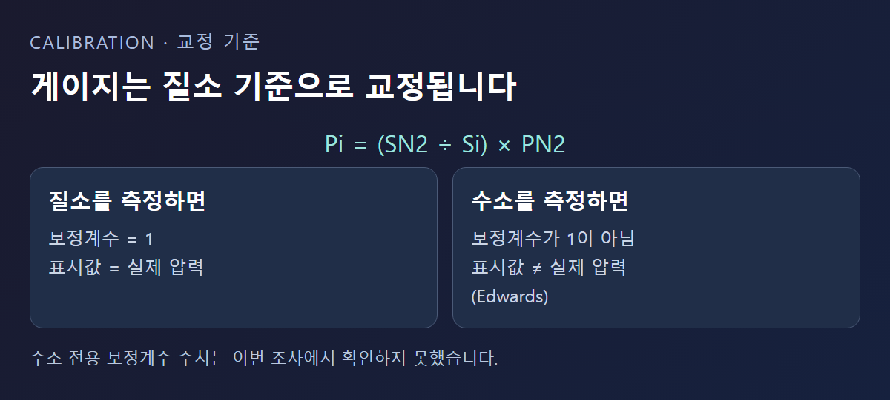

<!-- 수치검증: A항목 1개 확인(보정식 Pi=(SN2/Si)×PN2) / B항목 0개(해당없음) / C항목 1개 확인(APG200=피라니, AIM200=역자장, product_master_table 대조) / D항목 0개(해당없음) / 삭제 2개(수소 전용 보정계수 수치·방폭등급 수치, 근거 없음) / 교체 0개 -->

# 수소 설비 진공 측정, 가스 때문에 게이지 눈금이 틀어지는 이유

진공게이지 하나로 여러 가스를 측정하다 보면 같은 압력인데도 가스 종류에 따라 다른 숫자가 뜨는 경험을 하게 된다. 이는 게이지 고장이 아니라 대부분의 진공게이지가 원래 가진 근본적인 특성이다. 이 글은 왜 그런 일이 생기는지, 수소 설비에서는 무엇을 확인해야 하는지를 Edwards·Pfeiffer 공식 자료 기준으로 차례로 정리한다.

## 게이지는 원래 질소 기준으로 맞춰져 있다

Edwards는 진공게이지 제조사가 보통 질소로 교정하며, 질소를 측정할 때 보정계수는 1이라고 설명한다. 다른 가스를 측정할 때는 실제 압력을 Pi = (SN2÷Si) × PN2라는 식으로 환산해야 한다. 즉 화면에 뜬 숫자를 그대로 믿으면 안 되고, 측정하는 가스에 맞는 보정계수를 곱해야 실제 압력을 알 수 있다는 뜻이다. ([Edwards — Seven factors affecting the sensitivity of vacuum gauges](https://www.edwardsvacuum.com/en-us/vacuum-pumps/knowledge/applications/seven-factors-affecting-the-sensitivity-of-vacuum-gauges))

Edwards는 열식(피라니 계열) 게이지의 경우 무거운 분자일수록 더 큰 보정계수가 필요한 경향이 있다고 설명한다. 수소는 공기(질소)보다 가벼운 분자이므로, 이 원리에 따르면 질소 기준 표시값과 실제 수소 압력 사이에 차이가 생긴다는 결론이 나온다. 다만 정확한 방향과 배수는 게이지 모델마다 다르며, 수소 전용 보정계수 수치는 이번 조사에서 확인하지 못했다.

## 열식뿐 아니라 이온화 게이지도 가스에 따라 달라진다

Pfeiffer는 피라니(열전도) 게이지의 압력 표시값이 측정하는 가스 종류에 따라 달라진다고 설명한다. 질소·공기는 좋은 선형성을 보이지만 가벼운 가스(헬륨)와 무거운 가스(아르곤)는 뚜렷한 편차를 보인다는 것이다. 냉음극(콜드캐소드) 이온화 게이지도 마찬가지로 가스 종류에 따라 다른 압력을 나타내며, 예를 들어 헬륨은 공기보다 낮은 압력으로 표시된다고 설명한다. 열음극(핫캐소드) 이온화 게이지 역시 가스 의존적이다. ([Pfeiffer Vacuum — Total Pressure Measurement Fundamentals](https://www.pfeiffervacuum.com/us/en/knowledge/vacuum-technology/knowledge-book/5-vacuum-measuring-equipment/5_1_fundamentals_of_total_pressure_measurement/))

## 가스에 영향받지 않는 방식도 있다

Pfeiffer는 압력을 면적에 가해지는 힘으로 직접 측정하는 방식(정전용량식·다이어프램 게이지)은 가스 종류와 무관하게 압력을 측정한다고 설명한다. 열전도나 이온화 원리가 아니라 힘 자체를 재기 때문에 가스 성분이 바뀌어도 표시값이 흔들리지 않는다는 원리다.

스마텍이 취급하는 진공게이지(APG200·AIM200·WRG200)는 각각 피라니, 역자장(냉음극 계열), 피라니+역자장 복합 방식이다. 즉 위에서 설명한 가스 의존적 방식에 해당하며, 수소 같은 특수 가스를 측정할 때는 표시값이 질소 기준과 다를 수 있다는 점을 감안해야 한다. 스마텍이 정전용량식처럼 가스와 무관한 방식의 제품을 취급한다는 근거는 확인하지 못했다.

## 왜 이런 차이가 생기는지 조금 더 살펴보면

피라니 게이지는 가는 필라멘트(가열선)에서 주변 가스로 열이 빠져나가는 정도로 압력을 추정한다. 가스 분자의 종류에 따라 열을 옮기는 능력(열전도도)이 다르기 때문에, 같은 압력이라도 필라멘트가 식는 속도가 가스마다 달라져 다른 숫자로 읽힌다. 이온화 게이지는 가스 분자를 이온으로 만드는 확률이 가스마다 다르다는 점에서 비슷한 문제가 생긴다. 반면 정전용량식은 가스 분자 하나하나의 성질과 무관하게, 막을 미는 압력의 총합만 재기 때문에 이런 오차 자체가 원리적으로 발생하지 않는다는 것이 핵심 차이다. 대신 정전용량식은 구조가 더 복잡하고 가격도 높은 편이라, 정확도가 특히 중요한 지점에만 선택적으로 쓰는 경우가 많다는 점도 함께 고려한다.

## 보정계수를 실제로 어떻게 적용할까

게이지 매뉴얼에 실린 가스 보정계수표를 보면 보통 질소를 1로 놓고, 헬륨·아르곤 등 여러 가스에 대한 계수가 나열돼 있다. 수소가 표에 없다면 제조사에 직접 문의하거나, 표에 없는 가스는 화면의 숫자를 그대로 신뢰하지 않는다는 원칙으로 접근한다. Edwards의 환산식(Pi = (SN2÷Si) × PN2)에서 Si 값을 알아야 실제 압력을 계산할 수 있으므로, 이 계수 없이는 정확한 수치를 얻을 수 없다는 점을 감안한다.

같은 게이지라도 제조사·모델에 따라 보정계수가 다르게 나올 수 있다는 점도 유의할 부분이다. 다른 브랜드 게이지의 보정계수표를 그대로 가져와 쓰면 오차가 오히려 커질 수 있으므로, 지금 쓰고 있는 게이지의 매뉴얼을 우선 확인한다.

## 수소 설비에서 확인할 것

가스 의존적인 게이지를 수소 설비에 쓴다면, 게이지 제조사가 제공하는 가스 보정계수표를 확인해 화면에 뜬 값을 실제 압력으로 환산하거나, 처음부터 수소에 맞게 설정된 게이지를 쓰는 것이 정확도를 높이는 방법이다. 정확한 압력값이 공정에 중요한 경우라면 가스 의존성이 없는 측정 방식을 별도로 검토할 수도 있다.

수소는 가연성 가스이므로 게이지뿐 아니라 배관·밸브 전체에서 방폭 관련 사양이 필요한 설비인지도 별도로 확인해야 한다. 다만 이번 조사에서는 방폭 인증 등급의 구체적인 기준 수치를 확인하지 못해, 이 글에서는 "가연성 가스 전용 사양 확인이 필요하다"는 수준까지만 안내한다.

여러 공정 가스를 번갈아 쓰는 설비라면 게이지 하나로 모든 가스를 정확히 재기는 더 어려워진다. 이런 경우 공정별로 다른 보정계수를 적용하거나, 가장 자주 다루는 가스를 기준으로 게이지를 교정해 두고 나머지 가스는 환산값을 참고치로만 쓰는 방식이 현실적인 대안이 될 수 있다.

귀사 설비가 수소를 처리하는 진공 라인이라면 현재 쓰는 게이지의 방식(피라니·이온화·정전용량)과 교정 기준 가스가 무엇인지 먼저 확인해 보는 것이 첫 단계다. 매뉴얼을 찾기 어렵다면 게이지 겉면의 모델명만으로도 제조사에 방식과 보정계수표 유무를 문의할 수 있다.

---

가스 의존성을 고려한 진공게이지 방식 선정 상담 가능.
