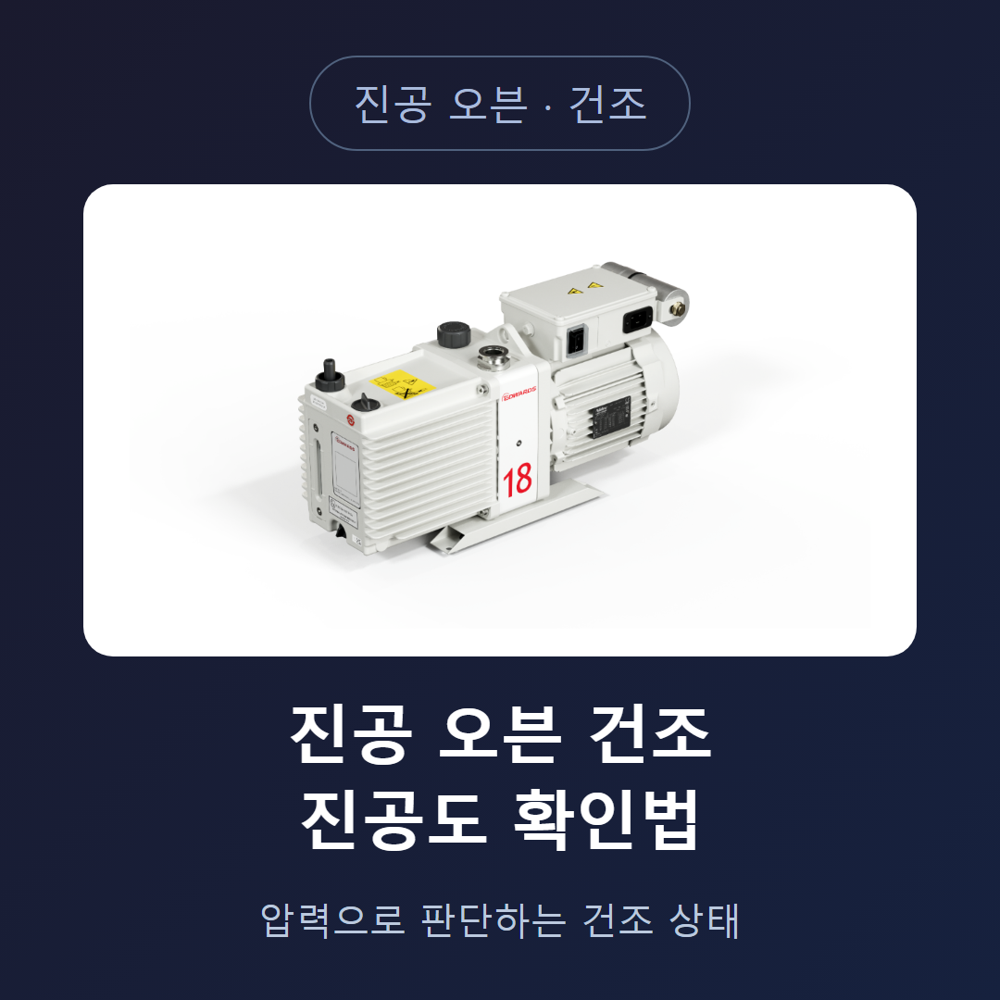
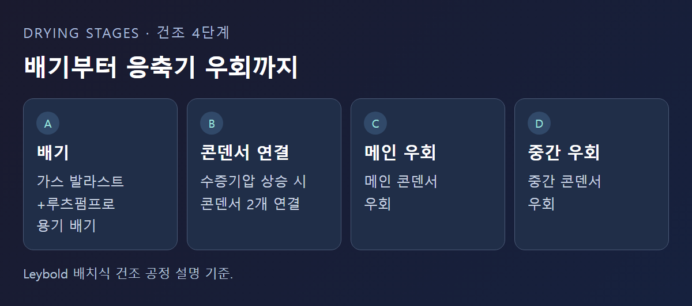
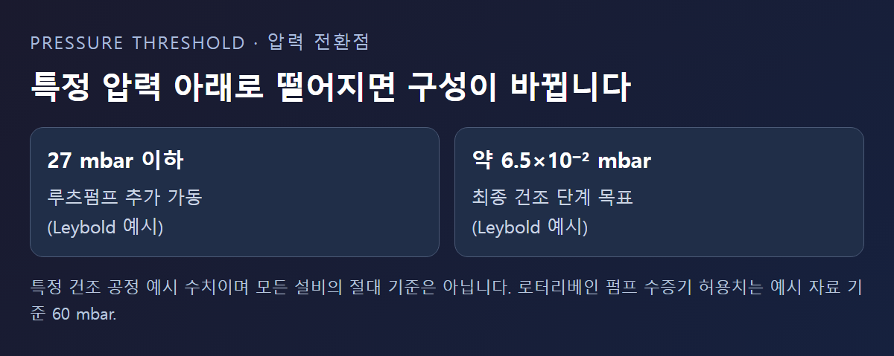
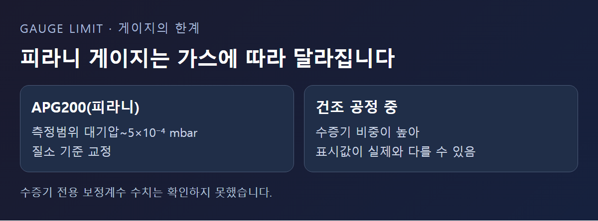

<!-- 수치검증: A항목 4개 확인(27 mbar·6.5e-2 mbar·60 mbar·0.65 mbar, 모두 Leybold 특정 예시로 명시) / B항목 0개(해당없음) / C항목 1개 확인(APG200=피라니, product_master_table 대조) / D항목 0개(해당없음) / 삭제 1개(수증기 전용 보정계수 수치, 근거 없음) / 교체 0개 -->

# 진공 오븐 건조 공정, 진공도는 어떻게 확인할까

진공 오븐을 돌릴 때 "지금 잘 되고 있는지" 여부를 무엇으로 판단해야 할지 막막할 때가 있다. 온도만 보고 있으면 안이 얼마나 말랐는지 알기 어렵고, 진공도만 보고 있으면 실제로 무엇을 확인하는 건지 헷갈리기 쉽다. 이 글은 Leybold의 공식 자료를 기준으로, 건조 공정에서 진공도가 어떤 의미를 갖고 어떻게 확인해야 하는지를 정리한다.

## 건조는 여러 단계로 나뉜다

스마텍이 Leybold 자료(How does the drying process work with a vacuum pump system, https://www.leybold.com/en-us/knowledge/vacuum-fundamentals/vacuum-generation/how-does-the-drying-process-work)를 확인한 결과, 배치식 진공 건조 공정은 네 단계로 나뉜다. 가스 발라스트 펌프와 루츠펌프로 용기를 배기하는 단계, 재료를 가열하며 수증기압이 올라가면 콘덴서(응축기) 두 개를 연결하는 단계, 그다음 메인 콘덴서를 우회하는 단계, 마지막으로 중간 콘덴서를 우회하는 단계다. 수분 함량은 시간이 지날수록 점점 느리게 줄어드는 경향을 보인다.

## 압력이 특정 값 아래로 떨어지면 펌프 구성이 바뀐다

스마텍이 Leybold 자료(How to select a vacuum pump for drying applications, https://www.leybold.com/en-in/knowledge/vacuum-fundamentals/vacuum-generation/pump-selection-for-drying-process)를 확인한 결과, 한 건조 공정 예시에서는 챔버 내 수분 압력이 27 mbar 아래로 떨어지면 루츠펌프를 추가로 가동하고 최종 건조 단계에서는 약 6.5×10⁻² mbar까지 압력을 더 낮추는 것으로 확인된다. 이 수치는 특정 건조 공정 예시에 나온 값이며, 모든 진공 오븐에 그대로 적용되는 절대 기준은 아니다. 자신의 설비가 어느 압력대에서 어떻게 반응하는지는 실제 운전 이력으로 직접 확인해야 한다.

로터리베인(오일) 펌프를 백킹 펌프로 쓸 때는 그 펌프의 수증기 허용치(예시 자료에서는 60 mbar)를 넘지 않도록 앞단의 루츠펌프가 수증기압을 먼저 낮춰줘야 한다. 가스 발라스트를 쓰는 백킹 펌프는 수증기압이 약 0.65 mbar에 이를 때까지 루츠펌프와 함께 배기를 담당한다는 예시도 있다.

## 최신 드라이펌프는 조금 다르게 대응한다

최신 드라이(오일 없는) 펌프 기술에서는 순간적으로 펌프의 수증기 허용치를 넘어서도, 그 수분이 펌프 안에서 잠깐 응축됐다가 다시 배출되는 방식으로 처리된다. 이 덕분에 복잡한 압력 조절 장치 없이도 운전할 수 있다는 것이 Leybold의 설명이다.

## 진공도는 결국 게이지로 확인한다

앞서 설명한 27 mbar, 6.5×10⁻² mbar 같은 기준값은 실제로는 게이지 눈금을 직접 읽어 확인한다. 스마텍이 취급하는 저진공 게이지 APG200(피라니 방식, 측정범위 대기압~5×10⁻⁴ mbar)은 이 정도 범위는 충분히 커버한다.

다만 앞서 다룬 "수소 설비 진공게이지" 글에서 설명했듯, 피라니 게이지는 가스 종류에 따라 표시값이 달라지는 방식이다. 건조 공정 중에는 챔버 안 수증기 비중이 높아지므로, 질소 기준으로 교정된 게이지가 실제 수증기압을 그대로 정확히 보여주지 못할 수 있다는 점도 감안해야 한다. 수증기 전용 보정계수 수치는 이번 조사에서 확인하지 못했다.

## 압력계만으로 판단하기 애매할 때

장시간 진행하는 건조 공정에서는 응축수 수집기를 콘덴서에서 차단해 두는 방법도 쓰인다. 이렇게 하면 냉각관에 남아 있던 응축막만 다시 증발하게 되는데, 이 재증발은 가스 발라스트 펌프 크기에 따라 30~60분 안에 끝난다는 것이 Leybold의 설명이다. 이는 압력계만으로 건조 완료 여부를 판단하기 애매할 때 참고할 수 있는 보조적인 시간 기준이며, 모든 설비에 그대로 적용되는 고정값은 아니다.

게이지를 챔버 어디에 다는지도 결과에 영향을 준다. 배기구 바로 앞에 달면 실제 챔버 안 압력보다 낮게 표시될 수 있고, 재료에서 먼 위치에 달면 국소적으로 압력이 높은 지점을 놓칠 수 있다. 여러 지점에 게이지를 달아 비교하기 어려운 소형 오븐이라면, 최소한 게이지 위치를 매번 동일하게 유지해 기록 간 비교가 가능하도록 하는 것이 중요하다. 위치를 바꾸면 이전 기록과 단순 비교가 어려워진다.

## 압력이 안 내려가면 어떻게 봐야 할까

건조 초반에는 압력이 빠르게 떨어지다가, 어느 시점부터 정체되는 구간이 생긴다. 이 정체는 대개 재료 표면과 내부에서 계속 수분이 빠져나오고 있다는 신호이지, 펌프나 게이지의 이상이 아닌 경우가 많다. 압력이 완만하게 계속 낮아지고 있다면 정상적인 건조 진행으로 보아도 무방하다. 문제는 이 정체가 정상적인 건조 진행인지, 아니면 누설이나 펌프 성능 저하 때문인지 구분하기 어렵다는 점이다. 이럴 때는 같은 재료·같은 조건으로 이전에 돌렸던 압력 기록과 비교해 보는 것이 가장 실질적인 판단 방법이다. 처음 돌리는 재료라면 시간대별 압력을 기록해 두고, 다음번 같은 재료를 건조할 때 비교 기준으로 삼는 것이 좋다. 재료 종류나 투입량이 달라지면 기준값도 함께 달라지므로 기록은 조건별로 구분해 남긴다.

## 건조 온도와 진공도는 같이 움직인다

재료를 가열하면 표면 온도가 올라가면서 수증기압이 함께 올라가고, 이 때문에 챔버 전체 압력도 일시적으로 오를 수 있다. 이 상승을 이상 신호로 오해하지 않으려면, 가열 시작 시점과 압력 변화 시점을 함께 기록해 두는 것이 도움이 된다. 온도 프로파일과 압력 그래프를 나란히 놓고 보면 두 값이 언제 함께 움직이는지 훨씬 쉽게 확인할 수 있다. Leybold가 설명하는 콘덴서 전환 단계도 결국 이 수증기압 상승에 대응하기 위한 절차다.

진공 오븐을 운전하고 계신다면 지금 어느 압력대에서 반응이 느려지는지, 그 지점에서 게이지 방식이 수증기를 정확히 읽고 있는지부터 확인해 보는 것이 첫 단계다.

---

건조 공정 압력 구간별 게이지·펌프 구성, 진공 오븐 신규 도입·교체 상담 가능.
