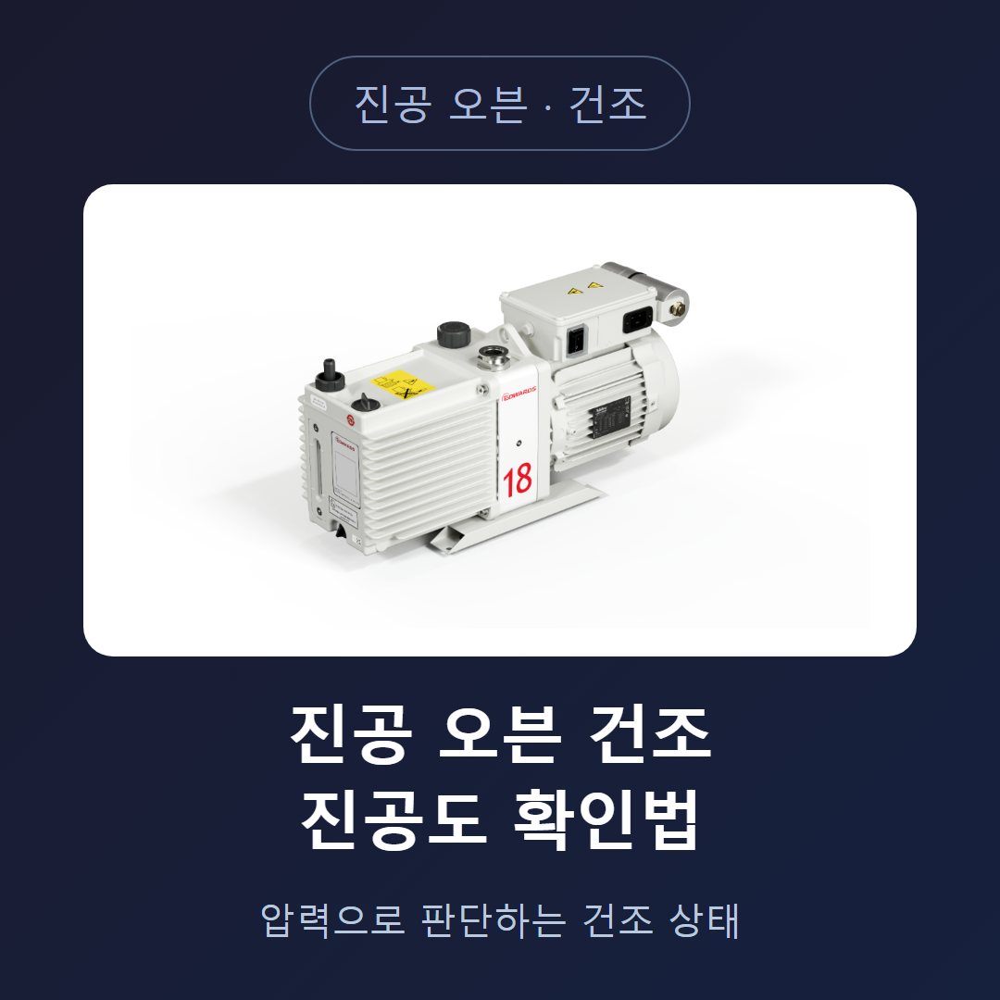
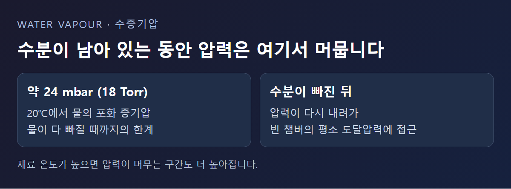
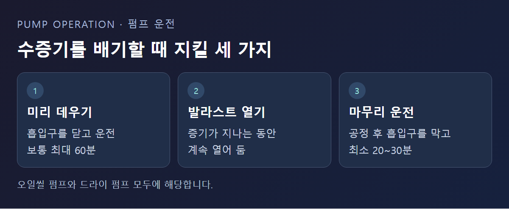
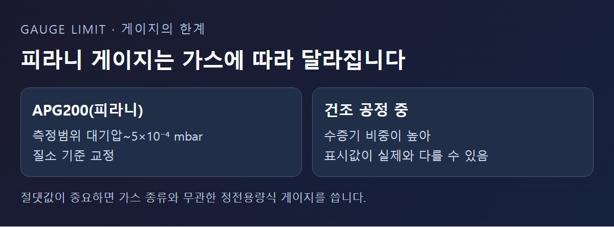

<!-- 수치검증: A항목 4개 확인(물 포화 증기압 약 24 mbar@20℃·워밍업 최대 60분·공정 후 20~30분 운전 = Edwards 자료 2건 / APG200 측정범위 = product_master_table) / B항목 0개(해당없음) / C항목 2개 확인(APG200=피라니, Barocel=정전용량식 — 대표님 취급 확인 10/9) / D항목 0개(해당없음) / 삭제 4개(27 mbar·6.5e-2 mbar·60 mbar·0.65 mbar — 타사 자료 예시, 10/9 출처 규칙) / 교체 0개 -->

# 진공 오븐 건조 공정, 진공도는 어떻게 확인할까

진공 오븐을 돌릴 때 "지금 잘 되고 있는지"를 무엇으로 판단해야 할지 막막할 때가 있다. 온도만 보고 있으면 안이 얼마나 말랐는지 알기 어렵고, 진공도만 보고 있으면 그 숫자가 무엇을 뜻하는지 헷갈리기 쉽다. 이 글은 건조 중 진공도가 어떻게 움직이는지, 그 숫자로 무엇을 판단할 수 있는지, 펌프와 게이지는 어떻게 다뤄야 하는지를 차례로 정리한다.

## 건조 중에는 압력이 한동안 내려가지 않는다

젖은 재료를 넣고 배기를 시작하면 압력이 빠르게 떨어지다가 어느 지점에서 멈춘 것처럼 보인다. 펌프가 약해져서가 아니다. 스마텍이 Edwards 자료(Why gas ballast is important on oil sealed rotary vane pumps?, https://www.edwardsvacuum.com/en/knowledge/applications/why-gas-ballast-is-important-on-oil-sealed-rotary-vane-pumps)를 확인한 결과, 물의 포화 증기압은 20℃에서 약 24 mbar(18 Torr)이며, 물이 모두 빠져나갈 때까지는 이 값이 펌프가 도달할 수 있는 가장 낮은 압력으로 확인된다.

증기를 배기하는 동안의 도달압력은 펌프 자체의 성능이 아니라 처리하는 물질의 증기압이 결정한다는 뜻이다. 재료에서 수분이 계속 나오는 동안에는 아무리 좋은 펌프를 달아도 압력이 그 아래로 잘 내려가지 않는다. 오븐을 가열해 재료 온도가 올라가면 물의 증기압도 함께 높아지므로, 압력이 머무는 구간은 상온일 때보다 더 높은 곳에 생긴다.

## 그래서 진공도는 건조가 끝났는지를 알려 준다

압력이 한 구간에 머물러 있다는 것은 재료에서 아직 수분이 나오고 있다는 신호다. 수분이 줄어들면 압력은 다시 내려가기 시작하고, 수분이 거의 다 빠지면 그 오븐과 펌프가 평소 빈 상태에서 도달하던 압력에 가까워진다.

그래서 진공도를 볼 때는 숫자 하나보다 흐름을 본다. 압력이 머물던 구간을 벗어나 다시 내려가기 시작한 시점, 그리고 빈 챔버의 평소 도달압력에 얼마나 가까워졌는지가 건조 진행을 판단하는 기준이 된다. 이 판단을 하려면 빈 챔버를 배기했을 때의 도달압력과 걸린 시간을 미리 한 번 기록해 두어야 한다.

## 펌프가 수증기를 감당하게 하려면

건조 공정에서 펌프는 공기보다 수증기를 훨씬 많이 배기한다. 수증기가 펌프 안에서 물로 응축되면 도달압력을 회복하는 시간이 크게 늘어나고, 오일씰 펌프는 오일이 빠르게 나빠진다. 스마텍이 Edwards 자료(How to pump condensable vapours?, https://www.edwardsvacuum.com/en-us/vacuum-pumps/knowledge/applications/how-to-pump-condensable-vapours)를 확인한 결과, 응축을 막는 운전 순서는 세 가지로 확인된다.

1. 수증기를 받기 전에 펌프를 정상 운전 온도까지 데운다. 흡입구 밸브를 닫고 돌리면 되며, 보통 최대 60분이 걸린다.
2. 증기가 펌프를 지나는 동안에는 가스 발라스트를 계속 열어 둔다.
3. 공정이 끝난 뒤에도 흡입구를 막은 채 최소 20~30분 더 운전해 남은 증기를 내보낸다.

이 순서는 오일씰 펌프와 드라이 펌프 모두에 해당한다. 가스 발라스트를 오래 열어 두는 오일씰 펌프라면 배기 쪽으로 넘어가는 오일을 오일 박스로 되돌려 주는 부속을 함께 다는 것이 좋다.

## 진공도는 게이지로 확인한다

건조 중 압력은 게이지 눈금으로 읽는다. 스마텍이 취급하는 저진공 게이지 APG200(피라니 방식, 측정범위 대기압~5×10⁻⁴ mbar)은 건조 공정에서 보는 압력 범위를 충분히 덮는다.

다만 "수소 설비 진공게이지" 글에서 설명했듯, 피라니 게이지는 가스 종류에 따라 표시값이 달라지는 방식이다. 건조 중에는 챔버 안 기체의 대부분이 수증기이므로, 질소 기준으로 맞춰진 게이지의 표시값이 실제 압력과 다를 수 있다. 같은 오븐에서 같은 게이지로 기록을 비교하는 데는 문제가 없지만, 압력의 절댓값이 중요한 공정이라면 가스 종류와 무관하게 측정하는 정전용량식 게이지(Edwards Barocel)를 쓰는 편이 맞다.

게이지를 챔버 어디에 다는지도 결과에 영향을 준다. 배기구 바로 앞에 달면 실제 챔버 안 압력보다 낮게 표시될 수 있고, 재료에서 먼 위치에 달면 국소적으로 압력이 높은 지점을 놓칠 수 있다. 여러 지점에 게이지를 달기 어려운 소형 오븐이라면, 게이지 위치를 매번 같게 유지해 기록끼리 비교할 수 있게 하는 것이 중요하다.

## 압력이 안 내려가면 어떻게 봐야 할까

압력이 머무는 것 자체는 건조 공정의 정상적인 모습이다. 문제는 이 정체가 수분 때문인지, 누설이나 펌프 성능 저하 때문인지 구분하기 어렵다는 점이다. 이럴 때는 같은 재료를 같은 조건으로 돌렸던 이전 기록과 비교하는 것이 가장 실질적인 방법이다. 평소보다 훨씬 오래 머문다면 재료의 수분량이 달라졌는지부터 보고, 빈 챔버로 돌려도 평소 도달압력이 나오지 않는다면 누설이나 펌프 쪽을 의심한다.

## 건조 온도와 진공도는 같이 움직인다

재료를 가열하면 표면 온도가 올라가면서 수증기압이 함께 올라가고, 챔버 압력도 일시적으로 오를 수 있다. 이 상승을 이상 신호로 오해하지 않으려면 가열 시작 시점과 압력 변화 시점을 함께 기록해 둔다. 온도 기록과 압력 기록을 나란히 놓고 보면 두 값이 언제 함께 움직이는지 쉽게 확인할 수 있다.

진공 오븐을 운전하고 있다면 빈 챔버의 평소 도달압력, 건조 중 압력이 머무는 구간, 그 구간을 벗어나는 데 걸리는 시간부터 기록해 보는 것이 첫 단계다.

---

건조 공정에 맞는 펌프·게이지 구성, 진공 오븐 펌프 신규 도입·교체 상담 가능.
