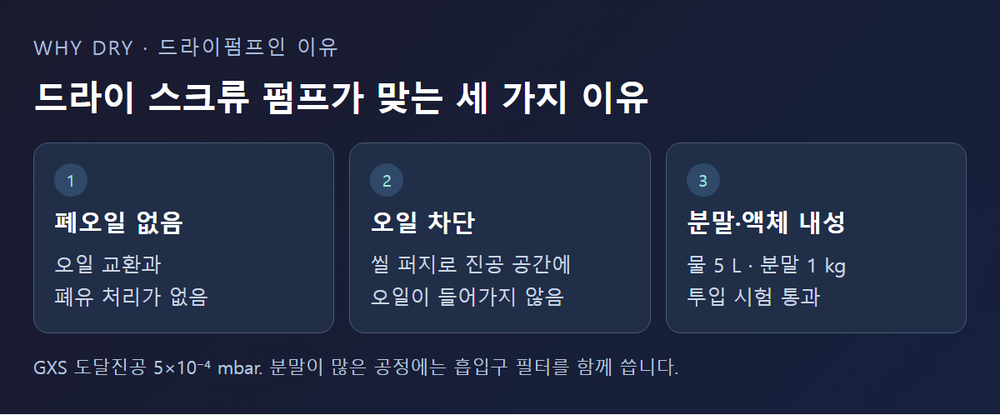

<!-- 수치검증: A항목 3개 확인(GXS 도달진공 5×10⁻⁴ mbar·물 5 L/분말 1 kg 처리 시험 = Edwards GXS 제품 자료 / E2M FX 산소농도 21% 초과 = E2M 제품 자료) / B항목 1개 확인(E2M+EH 부스터 조합 = E2M 제품 자료) / C항목 2개 확인(E2M·RV=오일로터리베인, GXS=드라이 스크류, product_master_table 대조) / D항목 1개 확인(E2M FX=PFPE 사양) / 삭제 3개(타사 자료에서만 확인된 수치·제품명, 10/9 출처 규칙) / 교체 0개 -->

# 태양광 패널 생산 라인의 진공펌프, 드라이펌프가 기본이 된 이유와 오일로터리의 오일 선택

태양광 패널을 만드는 라인에는 결정을 키우는 공정부터 박막을 입히고 모듈을 붙이는 공정까지 진공이 필요한 자리가 여러 곳 있다. 예전에는 오일로터리(오일씰) 펌프가 넓게 쓰였지만, 지금은 드라이펌프가 기본 선택이 됐다. 이 글은 그 이유와, 그래도 오일로터리 펌프를 쓰는 경우에 무엇을 기준으로 골라야 하는지를 정리한다.

## 태양광 제조에서 진공이 쓰이는 공정

스마텍이 Edwards 자료(Solar, https://www.edwardsvacuum.com/en/vacuum-pumps/our-markets/energy-solutions/renewable-energy/solar)를 확인한 결과, 태양전지는 결정질 실리콘, CdTe, CIGS, 실리콘 박막 같은 여러 방식으로 만들어지며, Edwards는 이 공정 전체에 드라이 진공펌프와 터보분자펌프, 배기가스 처리 시스템을 공급하는 것으로 확인된다. 해당 제품군은 반도체용 드라이펌프(iXM·iXH·iXL), 드라이 스크류 펌프(GXS·EDS), 자기부상 터보분자펌프(STP)다.

제조사가 태양광 공정용으로 내세우는 제품군에 오일씰 펌프가 들어 있지 않다는 점이 눈에 띈다. 새로 짓는 라인이라면 드라이펌프를 먼저 검토하는 것이 지금의 기본 방향이다.

## 드라이펌프가 기본이 된 이유

스마텍이 Edwards GXS 드라이 스크류 펌프 제품 자료를 확인한 결과, GXS의 적용 분야에는 실리콘 결정 인상(crystal-pulling)과 태양광 모듈 라미네이션, 유리 코팅, 로드락 챔버 배기가 포함돼 있다. 같은 자료에서 확인되는 특징은 세 가지로 정리할 수 있다.

1. 오염된 폐오일이 나오지 않는다. 오일 교환과 폐유 처리가 없어 유지 부담이 줄어든다.
2. 샤프트 씰 퍼지로 진공 공간에 오일이 들어가지 않게 한다. 오일이 공정 쪽으로 넘어갈 걱정을 덜 수 있다.
3. 액체와 분말을 견디는 힘이 크다. 물 5리터와 미세 분말 1kg을 한꺼번에 흘려 넣는 시험을 통과했고, 도달진공은 5×10⁻⁴ mbar다.

결정 인상처럼 분말이 생기는 공정에서는 세 번째 특징이 중요하다. 다만 드라이펌프도 고형물을 계속 빨아들이도록 만든 장비는 아니다. 분말이 많은 공정에서는 흡입구 필터를 달아 정비 간격을 늘리는 것이 좋다.

## 그래도 오일로터리 펌프를 쓰는 자리

오일로터리 펌프가 태양광 라인에서 완전히 사라진 것은 아니다. 이미 오일씰 기반으로 구성된 기존 설비를 유지하는 경우, 공정가스 부담이 적은 보조 배기에 쓰는 경우에는 오일로터리 펌프가 계속 쓰인다. 초기 도입 비용이 낮고 오랜 기간 검증된 기술이라는 장점도 여전하다.

스마텍이 취급하는 Edwards E2M 시리즈(중대형 오일로터리베인)는 적용 공정에 코팅이 포함돼 있고, EH 부스터와 조합해 큰 챔버를 낮은 압력까지 빠르게 배기하는 구성으로도 쓸 수 있다. 기존 라인을 유지 보수하는 쪽이라면 펌프 방식을 바꾸는 것보다 지금 쓰는 오일 사양이 공정에 맞는지부터 확인하는 것이 순서다.

## 오일로터리를 쓸 때는 오일 종류가 기준이 된다

오일로터리 펌프를 쓰기로 했다면 다음 기준은 어떤 오일을 쓰느냐다. E2M 시리즈는 일반 탄화수소 오일을 쓰는 표준 사양(HC) 외에, PFPE 오일을 쓰는 FX 사양을 따로 제공한다. FX 사양은 산소 농도가 21%를 넘는 혼합가스를 배기하기 위한 것이다. 소형 RV 시리즈에도 산소가 풍부한 환경을 위한 PFPE 사양이 있다.

일반 탄화수소 오일은 산소가 풍부한 환경에서 반응성이 높아질 수 있다. 그래서 산소가 관여하는 플라즈마 공정이나 코팅 공정에서는 PFPE 오일을 쓰는 것이 안전한 선택이다. 처리하는 가스에 산소가 얼마나 들어가는지가 오일을 고르는 첫 번째 질문이 된다.

오일 종류를 바꾸는 것만으로 안전성이 확보되는 것은 아니다. PFPE 오일을 쓰더라도 펌프의 씰링재와 배기 배관 재질이 공정가스와 맞지 않으면 다른 곳에서 문제가 생긴다. 오일 선택은 시스템 전체 사양을 검토하는 일의 한 부분으로 다뤄야 하며, 오일만 바꾸고 나머지 부품을 그대로 두는 방식은 권하지 않는다.

## 이미 오일로터리 펌프를 쓰고 있다면

오일 색과 상태를 정기적으로 확인해 산소나 공정가스와 반응한 흔적이 있는지 본다. 오일이 예상보다 빨리 변색되거나 점도가 달라졌다면 지금 오일 사양이 공정가스와 맞지 않을 가능성을 검토한다. 오일 교환 주기가 점점 짧아지고 있다면 드라이펌프로 바꾸는 쪽의 비용도 함께 따져 볼 시점이다.

## 신규 라인과 기존 라인은 검토 순서가 다르다

새 라인을 설계하는 경우에는 공정별로 필요한 배기 속도와 처리 가스를 먼저 정하고, 그에 맞는 드라이펌프와 부스터 조합을 고른다. 분말이 생기는 공정인지, 부식성 가스가 있는지에 따라 퍼지와 필터 구성이 달라지므로 이 조건을 먼저 정리해 두어야 한다.

기존 라인을 유지하는 경우에는 순서가 반대다. 지금 쓰는 펌프의 정비 이력과 오일 교환 주기부터 본다. 교환 주기가 일정하고 공정에 문제가 없다면 서둘러 바꿀 이유가 없다. 주기가 짧아지거나 공정 쪽에서 오일 오염이 의심될 때 드라이펌프 전환을 검토하면 된다.

## 정리하면

태양광 제조에서는 드라이펌프가 기본 선택이다. 폐오일이 없고, 진공 공간에 오일이 들어가지 않으며, 분말과 액체를 견디는 힘이 크기 때문이다. 오일로터리 펌프는 기존 설비를 유지하거나 부담이 적은 배기에 쓰는 자리에 남아 있고, 그때는 처리 가스에 산소가 관여하는지에 따라 일반 오일과 PFPE 오일을 가려 써야 한다.

공정 단계(결정 성장, 박막 코팅, 라미네이션, 로드락)와 처리 가스 조건, 신규 라인인지 기존 설비 유지인지를 알려주시면 맞는 펌프 구성과 오일 사양을 함께 확인해 드린다.

---

태양광 제조 공정별 드라이펌프·오일로터리 구성, PFPE 오일 사양 상담 가능.
