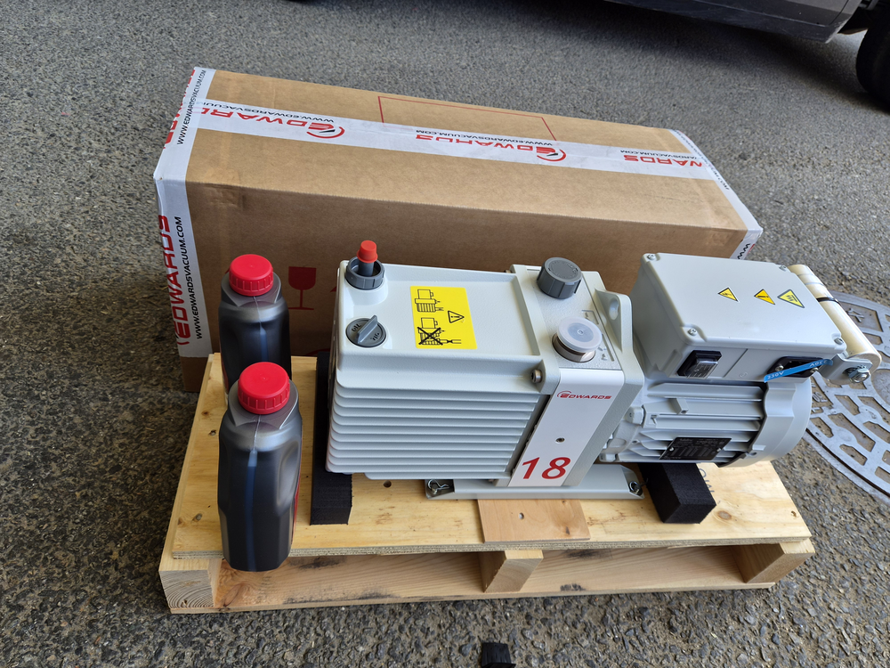
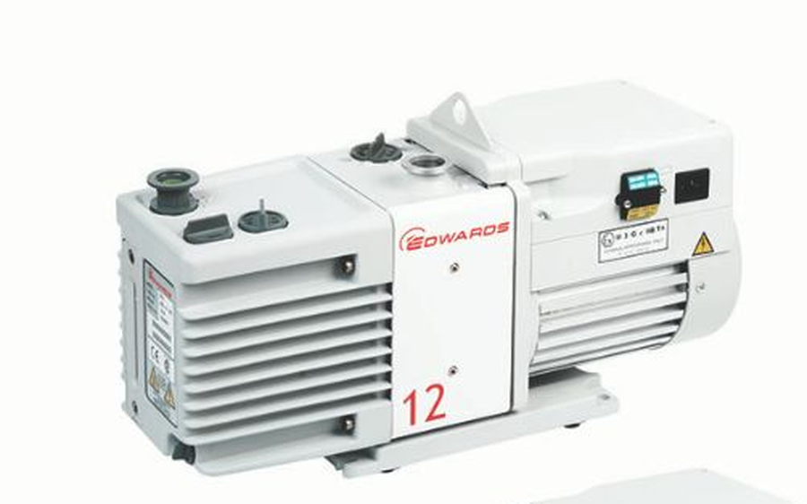
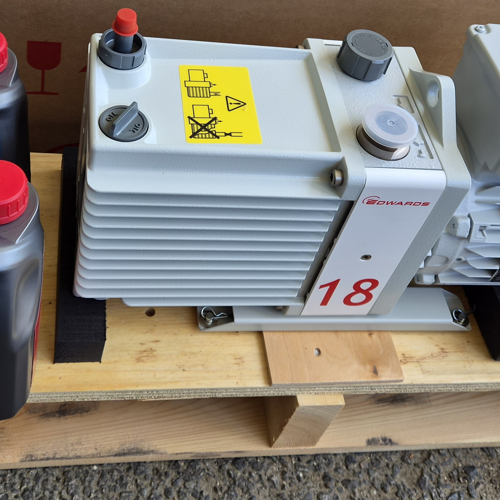

<!-- 수치검증: A항목 3개 확인 / B항목 0개 / C항목 1개 확인 / D항목 0개 / 삭제 0개 / 교체 0개 -->

# 진공오븐 배기용량 부족으로 RV12에서 E2M18로 교체한 사례

진공오븐은 시료·소재의 건조와 열처리 공정에서 수분과 가스를 빼내는 장비입니다. 처리하는 시료 양이나 챔버 크기가 늘어나면 같은 시간 안에 배기해야 할 부하도 함께 늘어나는데, 펌프 용량이 그대로면 목표 압력 도달 시간이 길어지거나 아예 목표 진공도에 도달하지 못하는 상황이 생길 수 있습니다.

2026년 9월 18일, 진공오븐 건조·열처리 공정에 Edwards E2M18 오일 로터리 펌프 1대를 납품했습니다. 기존에 Edwards RV12를 사용하던 현장으로, 처리용량 부족을 이유로 한 단계 상위 모델로 신규 구매를 결정한 사례입니다.

## 배기용량 부족의 원인 — 공정 규모와 펌프 용량의 불일치

RV12는 배기속도 12 m³/h, 도달진공도 2.0×10⁻³ mbar의 2단 오일 로터리 펌프로, 질량분석기·동결건조·코팅·진공오븐 등에 두루 사용되는 모델입니다(✅ 스마텍 내부 Product Master Table). RV 시리즈는 수증기 처리(290 g/h, 가스발라스트 II)에 강점이 있는 습식 공정용 라인업이며, RV12는 이 시리즈 중 최상위 용량 모델입니다(✅ [Edwards RV 시리즈 공식 제품페이지](https://www.edwardsvacuum.com/en-us/vacuum-pumps/our-products/oil-rotary-vane-pumps-two-stage/rv)).

문제는 RV12 자체의 결함이 아니라 공정 규모가 커지면서 펌프 용량이 상대적으로 부족해졌다는 점이었습니다. 처리 시료량이 늘어나거나 챔버 배기 부하가 커지면 같은 용량의 펌프로는 배기 시간이 길어지고, 목표 진공도까지 도달하지 못하는 현상이 반복될 수 있습니다.

## E2M18로 교체한 기술적 근거

E2M18은 배기속도 17 m³/h, 도달진공도 1.0×10⁻³ mbar의 2단 오일 로터리 펌프입니다(✅ 스마텍 내부 Product Master Table). RV12 대비 배기속도가 약 1.4배 늘어나고 도달진공도도 더 낮은 압력까지 내려가, 같은 공정에서 배기 시간을 단축하고 목표 압력 도달 여유를 확보할 수 있습니다.

오일은 기존과 동일한 Ultragrade 19를 그대로 사용하고, 배기부 미스트필터(EMF20)도 RV12·E2M18 배기 오일포집용으로 공용 사용이 가능합니다(✅ 스마텍 내부 Product Master Table). 펌프 계열을 오일식으로 유지한 채 용량만 상위 모델로 올리면서, 오일·소모품 운용 방식은 기존과 동일하게 유지할 수 있는 구성입니다.

## 드라이펌프가 아닌 오일식으로 유지한 이유

진공오븐 건조·열처리 공정처럼 수분·가스 배출량이 많은 습식 공정에서는 오일식 로터리 펌프가 여전히 널리 쓰입니다. 오일이 배기 과정에서 발생하는 수증기·오염물질을 함께 처리해주는 구조라 가스발라스트 기능과 맞물려 습식 부하에 강하기 때문입니다. 드라이펌프로 전환하면 오일 오염 걱정은 줄어들지만, 수분·입자가 많은 공정에서는 별도의 콜드트랩이나 필터 구성이 추가로 필요해질 수 있습니다.

이 현장은 기존 배관·컨트롤러가 오일식 로터리 펌프 기준으로 구성돼 있었고, 처리 대상도 순수 건조·열처리 공정이라 오일 오염이 문제 되는 정밀 분석장비와는 조건이 다릅니다. 그래서 펌프 계열을 바꾸지 않고 같은 오일식 안에서 용량만 올리는 방향이 설치 난이도와 운용 연속성 측면에서 더 합리적인 선택이었습니다.

## 납품 및 설치 구성

신품 E2M18과 전용 오일(Ultragrade 19) 2병을 함께 포장해 납품했습니다. 설치 시 신품 오일 충전과 진공오븐 배관 입구 규격(NW25, 2단 구성) 확인이 필요합니다(✅ 스마텍 내부 Product Master Table). 기존 RV12가 연결돼 있던 배관·전원 규격과 입구 사이즈가 다를 수 있으므로, 교체 전 배관 어댑터나 전원 사양(전압·상수)이 맞는지 먼저 확인하는 것이 설치 시간을 줄이는 방법입니다.

펌프를 처음 가동할 때는 오일 게이지로 유량을 확인하고, 가스발라스트 밸브를 열어 초기 배기 중 발생하는 수증기를 함께 배출하는 절차를 거칩니다. 목표 진공도에 도달한 뒤 정상 가동 여부를 확인하는 것으로 설치가 마무리됩니다. 이후에는 오일 색과 유량을 주기적으로 점검하며 기존 RV12를 운용하던 방식 그대로 관리하면 되고, 오일이 탁해지거나 색이 진해지면 교환 시점으로 판단합니다.

## 진공오븐 펌프 용량 재검토가 필요한 시점

같은 오일 로터리 펌프 계열을 쓰고 있어도 아래 상황이면 용량 재검토가 필요합니다.

- 목표 압력 도달 시간이 예전보다 눈에 띄게 길어졌을 때
- 시료 적재량이나 챔버 크기를 늘렸을 때
- 배기 후에도 목표 진공도까지 못 내려가는 경우가 반복될 때

이 경우 무작정 상위 모델로 바꾸기보다 현재 처리하는 시료 종류·양과 요구 진공도를 먼저 확인하는 것이 순서입니다. 오일식 계열 안에서 배기속도만 올리는 선택지도 있고, 수증기 처리량이 핵심 변수라면 다른 모델 계열이 더 맞을 수도 있습니다.

기존 배관·컨트롤러 구성을 그대로 유지하면서 펌프만 교체할 수 있는지도 확인이 필요한 부분입니다. 이번 사례처럼 입구 규격과 오일 계열이 같은 상위 모델로 교체하면 배관·전장 개조 없이 펌프 본체만 바꿔 증설할 수 있어 공사 범위를 최소화할 수 있습니다.

---

Edwards RV12→E2M18(2단 오일 로터리, 배기속도 12→17 m³/h, 도달진공도 2.0×10⁻³→1.0×10⁻³ mbar) 교체 사례입니다. 진공오븐 배기용량 재검토, 오일식·건식 펌프 선정, 배관·전원 규격 확인까지 함께 상담 가능합니다.
