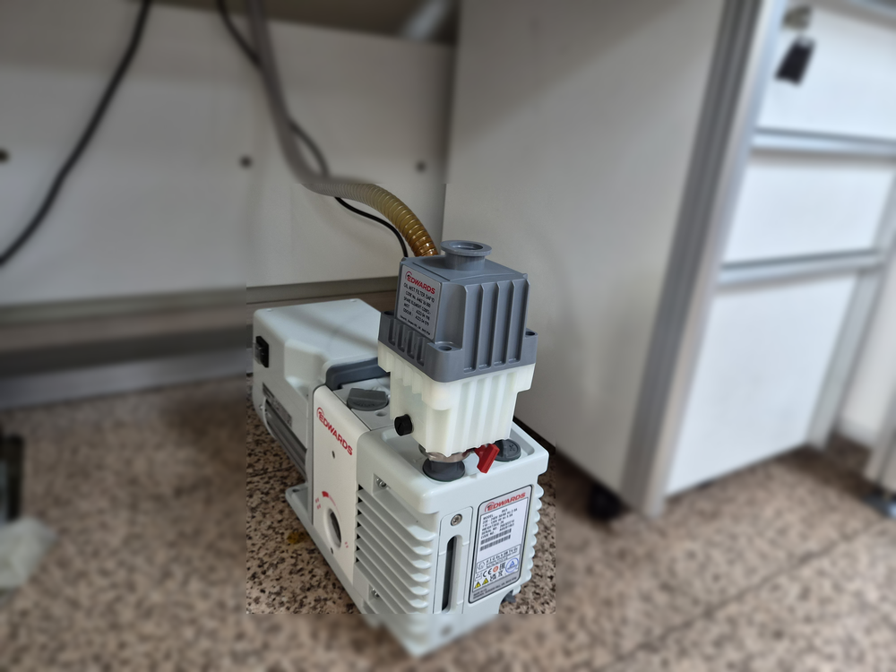
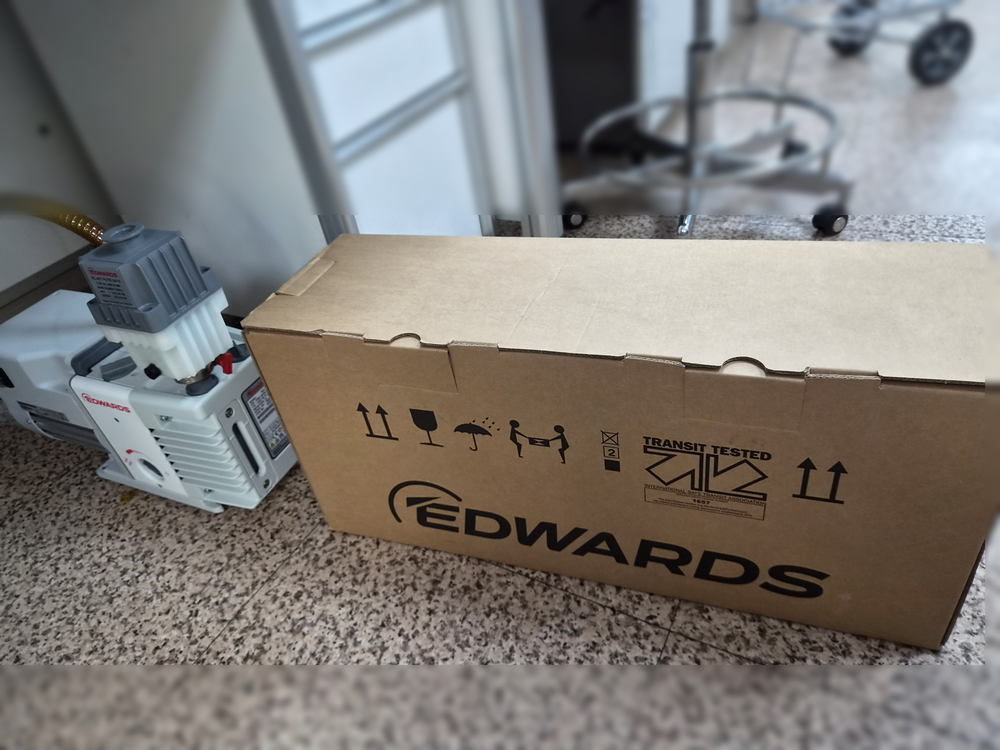
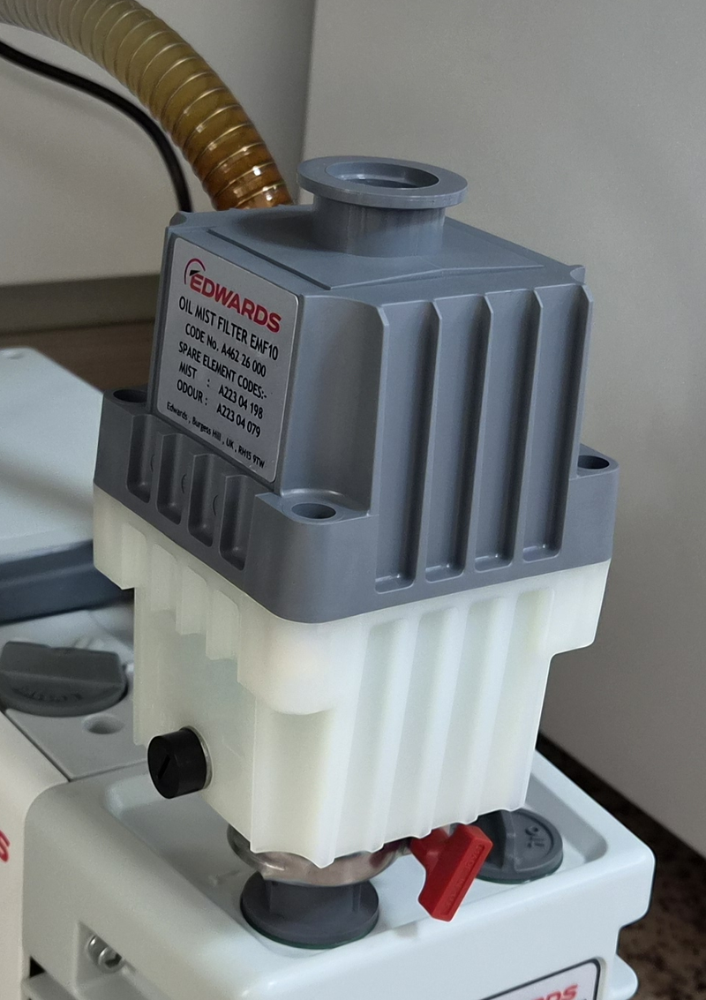

<!-- 수치검증: A항목 6개 확인 / B항목 0개 / C항목 2개 확인 / D항목 3개 확인 / 삭제 1개 / 교체 0개 -->

# GC-MS 진공펌프 누유로 RV3와 EMF10을 함께 교체 납품한 사례

GC-MS(가스크로마토그래프 질량분석기)에 붙는 소형 오일 로터리 펌프는 실험대 아래에서 분석 일정 내내 함께 돌아가는 경우가 많습니다. 이런 자리에서 펌프 오일이 새기 시작하면 바닥 오염과 오일 부족이 함께 생기고, 분석 일정에도 영향을 줄 수 있습니다.

2026년 9월 30일, 한 시험연구기관의 GC-MS에 Edwards RV3 오일 로터리 펌프 1대와 EMF10 오일 미스트필터를 함께 납품했습니다. 기존에는 타사 소형 2단 오일 로터리 펌프를 쓰고 있었는데, 오일 리크(누유)가 발생하면서 해당 기관이 내구성을 이유로 모델 변경을 결정한 사례입니다.

## 교체 배경 — 기존 펌프의 누유

이번 교체는 성능 부족이 아니라 누유가 출발점이었습니다. 분석장비용 펌프는 한 번 설치하면 오래 쓰는 설비라, 누유가 생긴 펌프를 계속 보수하며 쓸지 다른 모델로 바꿀지를 고객이 판단하게 됩니다. 해당 기관은 장기 운용 내구성을 기준으로 모델 변경을 선택했습니다.

누유가 보일 때는 교체를 결정하기 전에 위치부터 기록해 두는 것이 좋습니다. 오일 게이지 창 주변, 배수 플러그, 축 쪽, 배기구 주변 중 어디에서 오일이 나오는지에 따라 점검 방향이 달라지기 때문입니다. 특히 배기구 주변의 오일 흔적은 실제 누유가 아니라 배기 중에 나오는 오일 미스트가 쌓인 것일 수도 있어, 미스트필터가 달려 있는지도 함께 확인합니다.

## RV3를 선택한 이유

RV3는 배기속도 3.3 m³/h, 도달진공도 2.0×10⁻³ mbar의 소형 2단 오일 로터리베인 펌프입니다. 스마텍 제품 사양표에도 주요 적용 분야로 질량분석기·전자현미경·동결건조·코팅·진공오븐이 올라 있어, 기존과 같은 오일식 소형 펌프 자리에 그대로 들어갈 수 있는 등급입니다. 권장 오일은 Ultragrade 19이고, 가스발라스트는 2단계로 조절합니다.

분석장비 옆에서 쓰는 펌프라는 점에서 확인한 기능도 있습니다. 스마텍이 Edwards RV 시리즈 공식 제품페이지(https://www.edwardsvacuum.com/en-us/vacuum-pumps/our-products/oil-rotary-vane-pumps-two-stage/rv)를 확인한 결과, RV 시리즈에는 역류 방지 기능이 내장돼 있어 흡입 밸브가 0.4초 이내에 닫히면서 오일 미스트가 장비 쪽으로 들어가는 것을 막아 주고, 오일 양과 상태는 O-링으로 밀봉된 게이지 창으로 확인할 수 있습니다. 같은 페이지는 RV 시리즈의 적용 분야로 분석장비와 터보분자펌프 백킹을 함께 들고 있습니다.

다만 어떤 펌프든 오일 씰과 개스킷은 시간이 지나면 점검 대상이 됩니다. 새 펌프로 바꾼 뒤에도 오일 게이지 창으로 오일 양과 색을 주기적으로 확인하는 관리 방식은 그대로 이어가야 합니다.

## EMF10 미스트필터를 함께 구성한 이유

오일 로터리 펌프는 운전 중 배기구로 미세한 오일 미스트가 나옵니다. 실험실 안에 설치되는 분석장비용 펌프라면 이 미스트를 어떻게 처리할지가 설치 구성의 일부입니다. EMF10은 RV3~RV8 배기부의 오일을 포집하는 미스트필터로, 접속 규격은 NW25, 정격유량은 12 m³/h입니다. RV3 배기량에 맞는 크기라 펌프 위에 바로 올려 쓰는 구성입니다.

이번 현장에서는 RV3 배기구에 EMF10을 장착하고, 필터 출구에 배기 호스를 연결해 실험대 아래에 설치했습니다. 이렇게 구성하면 배기 쪽 오일 흔적을 누유와 구분해서 보기도 수월해집니다.

## 설치 후 관리 포인트

새 펌프는 권장 오일인 Ultragrade 19를 게이지 창 기준선에 맞춰 채운 상태로 운전을 시작합니다. 이후 관리는 크게 세 가지입니다.

- **오일 양과 색**: 게이지 창으로 오일이 기준선 아래로 내려가지 않았는지, 색이 탁해지거나 진해지지 않았는지 봅니다. 오일 양이 눈에 띄게 줄면 누유나 배기 쪽 손실을 의심하고 위치를 확인합니다.
- **가스발라스트**: 스마텍이 확인한 Edwards RV 시리즈 자료 기준으로 RV 시리즈는 모드 선택과 2단 가스발라스트로 일반 운전과 증기 처리량이 많은 운전을 나눠 쓸 수 있습니다. 응축성 증기가 많은 작업이 아니라면 평소 설정을 유지하고, 조건이 바뀔 때 설정을 다시 확인합니다.
- **미스트필터 엘리먼트**: EMF10 라벨에는 교체용 엘리먼트 코드가 함께 적혀 있습니다. 이번에 설치한 필터 라벨 기준으로 미스트 엘리먼트는 A223 04 198, 냄새 제거(ODOUR) 엘리먼트는 A223 04 079입니다. 필터 쪽에 오일이 많이 고이거나 배기 저항이 커진 것 같으면 엘리먼트 상태를 확인합니다.

## 분석장비용 펌프를 바꿀 때 확인할 것

지금 쓰시는 GC-MS 펌프에서 오일이 비친다면 아래 순서로 먼저 확인해 보시길 권합니다.

- 오일이 나오는 위치와 오일 양(게이지 창 기준선 대비)을 기록한다
- 배기구에 미스트필터가 있는지, 필터 상태는 어떤지 본다
- 같은 위치에서 누유가 반복되면 보수와 교체 중 어느 쪽이 맞는지 판단한다
- 교체한다면 장비 쪽 배관 접속 규격과 전원 사양이 새 펌프와 맞는지 미리 확인한다

---

Edwards RV3(소형 2단 오일 로터리베인, 3.3 m³/h, 2.0×10⁻³ mbar)와 EMF10 오일 미스트필터를 GC-MS용으로 함께 납품한 사례입니다. 분석장비용 펌프의 누유 점검, 교체 모델 선정, 배기 미스트 처리 구성을 함께 상담할 수 있습니다.
