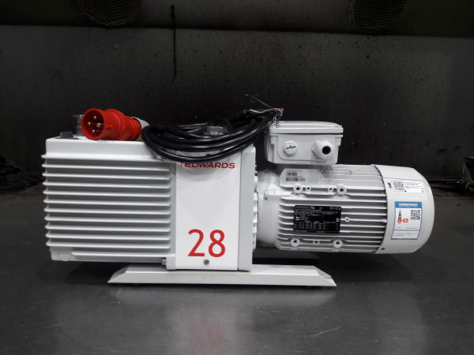
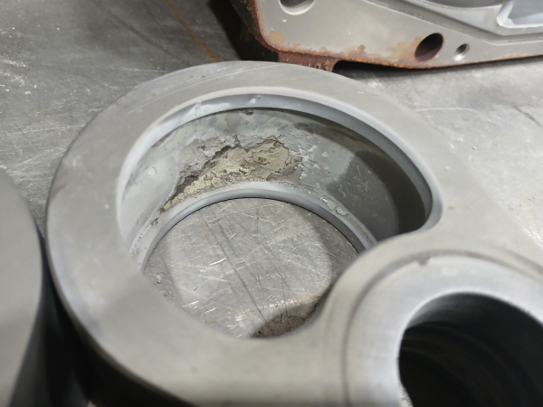
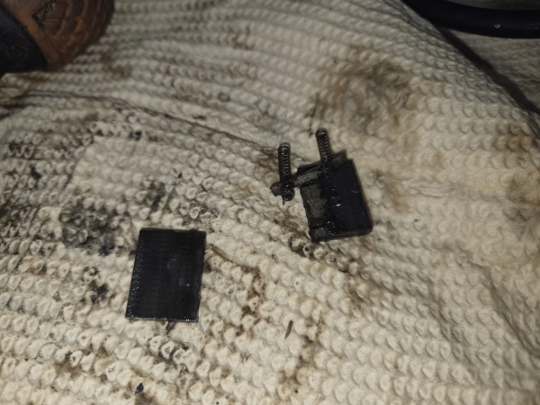
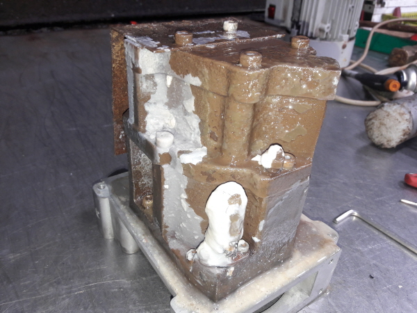
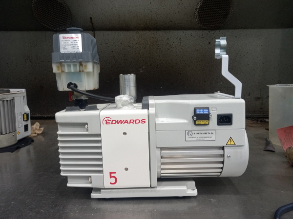

<!-- 수치검증: A항목 25개 확인 / B항목 0개 / C항목 3개 확인 / D항목 2개 확인 / 삭제 0개 / 교체 2개 -->

# 2026년 9월 진공펌프 수리사례 5건 정리 — 오일식 4대·드라이펌프 1대

2026년 9월에 스마텍이 수리를 마치고 공개한 진공펌프는 5대입니다. 오일을 쓰는 펌프가 4대(Edwards RV5·E2M28, Pfeiffer Vacuum DUO2.5, 우성진공 W2V20), 드라이펌프가 1대(Edwards iH1800MK5)였습니다. 5대 모두 수리 후 검사성적서의 전 항목을 통과했고, 시험 운전은 12~16시간 진행했습니다.

아래에서는 사례별로 확인된 증상·작업·검사 결과를 정리하고, 이번 달 사례에서 보인 공통점과 점검 포인트를 덧붙입니다. 각 사례의 사진과 고객 정보를 지운 검사성적서는 [공개 수리 사례](https://www.smartechvacuum.com/repair) 페이지에서 볼 수 있습니다.

## 사례별 요약

### 1. Edwards iH1800MK5 — 공정 부산물 오염, 정기 오버홀

iH 계열은 루츠와 클로 방식을 함께 쓰는 드라이 주 펌프로, CVD·ALD 같은 공정에 쓰이는 라인업입니다. 분해해 보니 스테이터 안쪽에 공정 부산물이 쌓여 있었고, 오버홀 키트 교체(오링·베어링·씰·슬리브·필터·오일)로 정기 오버홀을 진행했습니다.

- 검사 결과: 진공 7.2×10⁻³ Torr(기준 9.0×10⁻³ Torr 이하), 전류 8.2 A(16 A 이하), 본체 온도 126℃(160℃ 이하), 리크 PASS, 시험 16시간

### 2. Pfeiffer Vacuum DUO2.5 — 블레이드 파손, 모터 슬리브 마모

분해 과정에서 블레이드 파손과 모터 슬리브 마모가 확인됐습니다. 기본수리(오링·오일씰·배기밸브·베어링·슬리브 교체)와 함께 모터 슬리브를 교체했습니다.

- 검사 결과: 진공 5.9×10⁻³ Torr(9.0×10⁻³ Torr 이하), 전류 1.3 A(2.2 A 이하), 본체 온도 54℃(80℃ 이하), 리크 PASS, 시험 12시간

### 3. Edwards E2M28 — 모터 코일 소손

모터가 타서 입고된 건입니다. 모터 코일 작업과 함께 기본수리(개스킷·오일씰·립씰·슬리브·베어링·배기밸브 교체)를 진행했습니다.

- 검사 결과: 진공 2.8×10⁻³ Torr(9.0×10⁻³ Torr 이하), 전류 1.3 A(2.2 A 이하), 본체 온도 52℃(80℃ 이하), 리크 PASS, 시험 12시간

### 4. 우성진공 W2V20 — 내부 부식과 오염

케이스와 펌프 블록 표면에 녹과 흰색 퇴적물이 넓게 퍼져 있던 건입니다. 내부를 정리하고 기본수리 부품을 교체했습니다.

- 검사 결과: 진공 3.2×10⁻³ Torr(9.0×10⁻³ Torr 이하), 전류 1.1 A(2.5 A 이하), 본체 온도 43℃(80℃ 이하), 리크 PASS, 시험 12시간

### 5. Edwards RV5 — 분석 연구소 정기 기본수리

분석 연구소에서 정기 점검으로 들어온 건입니다. 개스킷·오일씰·립씰·오링·샤프트 슬리브 키트·모터 베어링·배기밸브를 교체하고 오일을 새로 채웠습니다.

- 검사 결과: 진공 3.2×10⁻³ Torr(9.0×10⁻³ Torr 이하), 전류 1.5 A(3.4 A 이하), 본체 온도 50℃(80℃ 이하), 리크 PASS, 시험 12시간

## 이달 사례에서 보인 점

이번 달 오일식 4대 중 정기 기본수리만으로 끝난 건은 RV5 1대였습니다. 나머지 3대는 블레이드·모터 슬리브(DUO2.5), 모터 코일(E2M28), 내부 부식(W2V20)처럼 기본 소모품 외의 부위까지 손을 대야 했습니다. 5건뿐인 표본이라 일반적인 경향으로 볼 수는 없습니다. 다만 같은 오일식 펌프라도 증상에 따라 작업 범위가 기본 소모품 교체에서 모터·블레이드 작업까지 크게 달라진다는 점은 확인할 수 있습니다.

드라이펌프인 iH1800MK5는 공정 부산물이 쌓인 상태에서 정기 오버홀로 들어왔습니다. 이번 건도 분해한 뒤에야 스테이터 안쪽 퇴적 상태를 확인할 수 있었습니다. 공정 부산물이 생기는 라인이라면 정기 오버홀 때 퇴적 부위와 정도를 사진으로 남겨 두면 다음 주기를 정할 때 비교 자료가 됩니다.

## 검사성적서에서 확인하는 항목

공개 수리 사례의 검사성적서는 수리를 마친 펌프를 시험 운전하며 아래 항목을 모델별 기준값과 비교해 판정합니다.

- **진공도·운전 전류·본체 온도**: 측정값과 기준값을 함께 적습니다. 9월 5건의 진공도는 2.8×10⁻³~7.2×10⁻³ Torr로 모두 기준(9.0×10⁻³ Torr 이하) 안이었습니다.
- **리크·오일 누설·물 누설·소음·기능 시험**: 통과 여부와 유무로 판정하며, 9월 5건 모두 이상이 없었습니다.
- **시험 시간과 오일**: 오일식 4대는 12시간 시험 후 미네랄 오일을 채워 출고했고, iH1800MK5는 16시간 시험 후 Fomblin 오일을 채웠습니다.

## 점검 포인트

- **오일 상태와 양**: 오일식 펌프는 게이지 창으로 오일 색과 양을 주기적으로 봅니다. 스마텍이 Edwards RV 시리즈 공식 자료를 확인한 결과, RV 시리즈는 O-링으로 밀봉된 게이지 창으로 오일 양과 상태를 확인하고, 모드 선택과 2단 가스발라스트로 증기 처리량이 많은 운전에 대응하도록 돼 있습니다. 응축성 증기가 많은 공정이라면 가스발라스트 설정을 확인해 보시길 권합니다.
- **운전 전류 기록**: 이번 검사성적서에도 모델별 전류 기준값이 있습니다. 평소 운전 전류를 기록해 두면 모터 쪽 이상을 비교할 기준이 생깁니다.
- **증상 기록**: 소음, 진공 도달 시간, 온도 변화를 날짜와 함께 남겨 두면 수리 범위를 판단할 때 도움이 됩니다.

---

2026년 9월 수리 완료 5건(Edwards RV5·E2M28·iH1800MK5, Pfeiffer Vacuum DUO2.5, 우성진공 W2V20)의 증상·작업·검사 결과 정리입니다. 사례별 사진과 고객 정보를 지운 검사성적서는 공개 수리 사례 페이지에서 확인할 수 있습니다.
